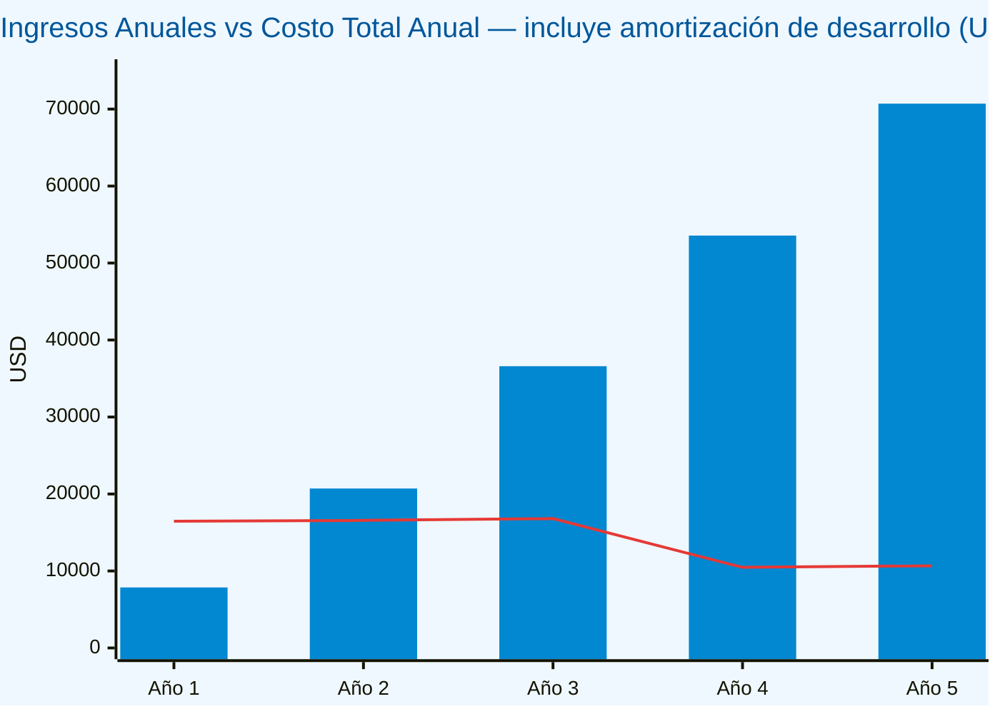
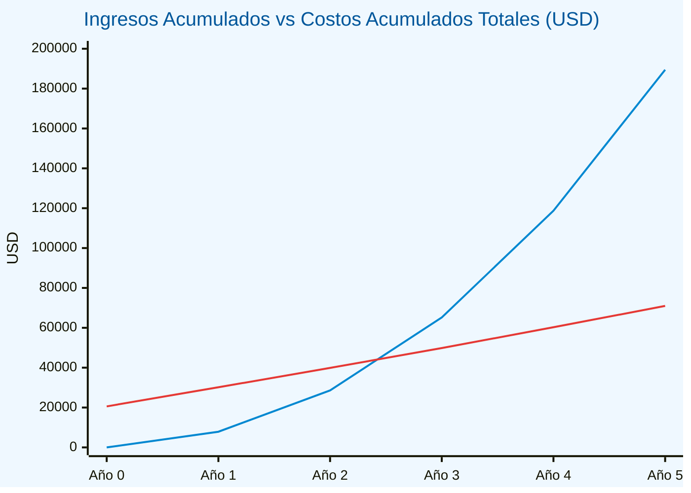

# Gráfica — Ingresos vs Costos Totales (Desarrollo + Mantenimiento)

> Los costos incluyen la inversión inicial de desarrollo (**$20,570**) más los costos anuales de mantenimiento (§2.7).  
> El desarrollo se amortiza en línea recta a 3 años (**$6,857/año** · Años 1–3 · $0 · Años 4–5).

---

## Datos base

| Concepto | Año 0 | Año 1 | Año 2 | Año 3 | Año 4 | Año 5 |
|:---------|------:|------:|------:|------:|------:|------:|
| Ingresos anuales | — | $7,860 | $20,712 | $36,600 | $53,568 | $70,704 |
| Mantenimiento (§2.7) | — | $9,603 | $9,713 | $9,944 | $10,472 | $10,670 |
| Amortización desarrollo | — | $6,857 | $6,857 | $6,857 | $0 | $0 |
| **Costo total del período** | **$20,570** | **$16,460** | **$16,570** | **$16,801** | **$10,472** | **$10,670** |
| **Ingresos acumulados** | $0 | $7,860 | $28,572 | $65,172 | $118,740 | $189,444 |
| **Costos acumulados** | $20,570 | $30,173 | $39,886 | $49,830 | $60,302 | $70,972 |

> **Nota:** El "Costo total del período" del Año 0 corresponde íntegramente a la inversión inicial de desarrollo.  
> Los costos acumulados convergen hacia $70,972 (inversión total a 5 años = desarrollo + mantenimiento).

---

## Gráfica 1 — Ingresos anuales vs Costo total anual (con amortización)

> **Barras (azul)** = Ingresos anuales por suscripciones.  
> **Línea (roja)** = Costo total anual: mantenimiento + amortización del desarrollo ($6,857/año en Y1–Y3).  
> Los ingresos superan el costo total anual a partir del **Año 2** (~$20,712 vs $16,570). En el Año 4 y 5 la línea de costos baja notablemente al quedar la inversión completamente amortizada.

---

## Gráfica 2 — Ingresos acumulados vs Costos acumulados (Punto de Equilibrio)

> **Línea azul** = Ingresos acumulados por suscripciones (arranca en $0).  
> **Línea roja** = Costos acumulados totales: $20,570 de desarrollo + mantenimiento año a año (arranca en $20,570).  
> Las líneas se **cruzan entre el Año 2 y el Año 3** — punto de equilibrio en el **mes 30** desde el lanzamiento.  
> Al cierre del Año 5, los ingresos acumulados ($189,444) superan en **~$118,472** a los costos totales acumulados ($70,972).

---

## Resumen del cruce de equilibrio

| Año | Ingresos acumulados | Costos acumulados | Diferencia |
|----:|--------------------:|------------------:|-----------:|
| 0 | $0 | $20,570 | −$20,570 |
| 1 | $7,860 | $30,173 | −$22,313 |
| 2 | $28,572 | $39,886 | −$11,314 |
| **3** | **$65,172** | **$49,830** | **+$15,342 ✅** |
| 4 | $118,740 | $60,302 | +$58,438 |
| 5 | $189,444 | $70,972 | +$118,472 |

---

*Última actualización: mayo 2026*
