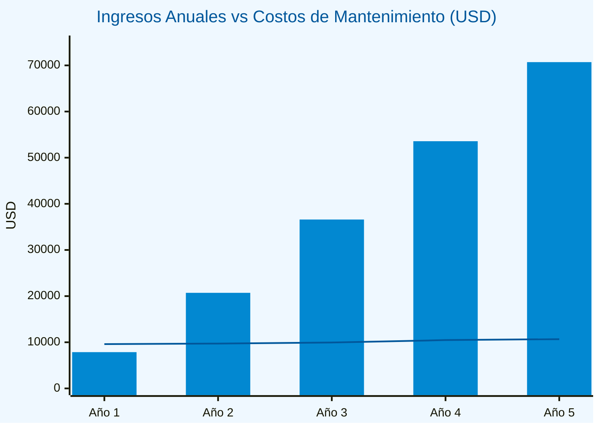
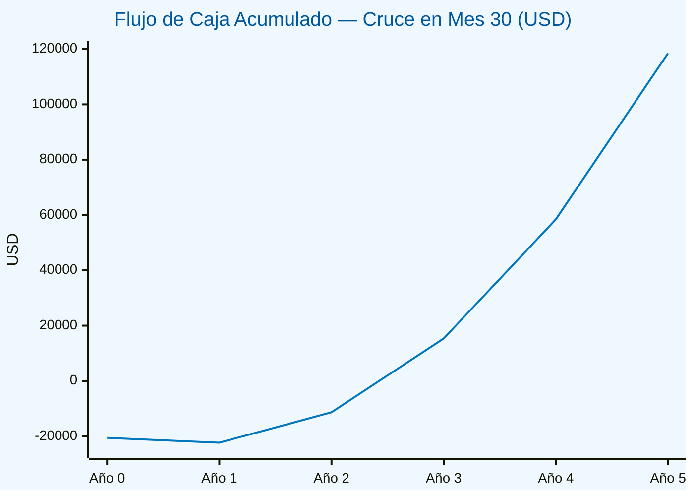

# GestPro CRM Inmobiliario — Módulos del Sistema

> **Versión:** 1.0  
> **Fecha:** 13 de mayo de 2026  
> **Sistema:** GestPro CRM Inmobiliario  
> **Arquitectura:** Monorepo (NestJS + React + Next.js + React Native)

---

## Módulos Principales

1. Autenticación y Seguridad
2. Multitenancy y Control de Acceso (RBAC)
3. Auditoría
4. Gestión de Propiedades
5. Propietarios y Expediente Legal
6. Portal Público
7. Gestión de Clientes
8. Embudo de Ventas (Pipeline)
9. Interacciones y Comunicaciones
10. Agenda y Visitas
11. Marketing y Redes Sociales
12. Business Intelligence y Reportes
13. Notificaciones
14. Integraciones Externas
15. App Móvil
16. Herramientas Transversales

---

## Stakeholders

| # | Stakeholder | Rol en el sistema |
|:--|:------------|:------------------|
| 1 | **Super Admin** | Operador de la plataforma SaaS; administra tenants y configuración global |
| 2 | **Gerente de Agencia** | Admin del tenant; gestiona agentes, reportes y configuración de la empresa |
| 3 | **Agente Senior** | Gestiona propiedades, clientes y pipeline; supervisa agentes junior |
| 4 | **Agente Junior** | Opera propiedades y clientes bajo supervisión; visibilidad limitada |
| 5 | **Cliente** | Usuario del portal público; busca propiedades y agenda visitas |
| 6 | **Equipo de Desarrollo** | Construye, mantiene y despliega el sistema |
| 7 | **Dueño de Empresa PYME** | Propietario de la agencia inmobiliaria; define requerimientos de negocio y aprueba entregables |
| 8 | **QA / Tester** | Valida la calidad funcional y de seguridad de cada módulo |

---

## Matriz RACI

**R** = Responsible · **A** = Accountable · **C** = Consulted · **I** = Informed

| Tarea | Super Admin | Gerente | Ag. Senior | Ag. Junior | Cliente | Dueño PYME | Dev | QA |
|:------|:-----------:|:-------:|:----------:|:----------:|:-------:|:----------:|:---:|:--:|
| Análisis de Requisitos | C | C | C | I | C | A | R | I |
| Diseño del Sistema | I | C | I | — | — | C | A | C |
| Desarrollo de Software | I | I | — | — | — | I | A | C |
| Pruebas del Sistema | I | I | I | — | — | I | R | A |
| Documentación Técnica | I | I | — | — | — | I | A | C |
| Validación de Usuario | I | C | R | R | R | A | C | C |
| Presentación Final | C | C | I | — | — | A | R | I |
| Implementación | A | C | I | — | — | C | R | C |
| Capacitación de Usuario | I | A | R | R | C | C | C | I |
| Soporte Post-Entrega | A | C | I | I | I | C | R | C |
| Control de Calidad | I | I | I | — | — | C | C | A |
| Evaluación Final | C | C | C | I | C | A | R | C |

---

## b. Mapa de Poder-Interés

Clasifica a los stakeholders según su nivel de **poder** (capacidad de influir en el proyecto) e **interés** (grado de afectación por el resultado).

```
PODER
  Alto │ Gerente de Agencia   │ Dueño de Empresa PYME
       │ Super Admin          │
       │─────────────────────────────────────────────
  Bajo │ Agente Junior        │ Agente Senior
       │ QA / Tester          │ Cliente
       │ Equipo de Desarrollo │
       └──────────────────────┴──────────────────────
              Interés Bajo         Interés Alto
```

| Stakeholder | Poder | Interés | Cuadrante | Estrategia |
|:------------|:-----:|:-------:|:----------|:-----------|
| Dueño de Empresa PYME | Alto | Alto | **Gestionar de cerca** | Involucrar en decisiones clave, validaciones y aprobaciones de entregables |
| Gerente de Agencia | Alto | Alto | **Gestionar de cerca** | Reuniones frecuentes, reportes de avance, validación de requisitos funcionales |
| Super Admin | Alto | Bajo | **Mantener satisfecho** | Informar sobre cambios de infraestructura y seguridad; no saturar con detalles |
| Agente Senior | Bajo | Alto | **Mantener informado** | Consultar en validaciones de usuario; incluir en pruebas de aceptación |
| Cliente | Bajo | Alto | **Mantener informado** | Recoger feedback sobre portal público y flujo de visitas; encuestas de satisfacción |
| Equipo de Desarrollo | Bajo | Bajo | **Monitorear** | Comunicar cambios de alcance; asegurar claridad en requerimientos técnicos |
| Agente Junior | Bajo | Bajo | **Monitorear** | Informar sobre cambios en su flujo de trabajo; capacitar en nuevas funcionalidades |
| QA / Tester | Bajo | Bajo | **Monitorear** | Proveer criterios de aceptación claros; revisar resultados de pruebas |

---

## Casos de Uso

| No. | Nombre del Caso de Uso |
|:----|:-----------------------|
| HU-01.01 | Gestión de Empresas (Tenants) |
| HU-02.01 | Autenticación con 2FA y Bloqueo Progresivo |
| HU-02.02 | Recuperación de Cuenta |
| HU-02.03 | Onboarding de Primer Acceso |
| HU-03.01 | Auditoría Inmutable de Acciones |
| HU-04.01 | Jerarquía Organizacional y RBAC |
| HU-05.01 | CRUD de Propiedades y Ciclo de Vida |
| HU-05.02 | Carga de Multimedia y Geolocalización |
| HU-05.03 | Gestión de Propietarios y Expediente Legal |
| HU-05.04 | Generación y Distribución de Brochure PDF |
| HU-06.01 | Portal Público con Búsqueda Avanzada |
| HU-06.02 | Registro de Cliente y Alertas de Matching |
| HU-07.01 | Inicio de Trámite y Vista Kanban |
| HU-07.02 | Máquina de Estados del Embudo de Ventas |
| HU-08.01 | Timeline de Interacciones con Clientes |
| HU-08.02 | Tareas Automáticas y Tracking de Email |
| HU-09.01 | Agendamiento de Visitas con Invitación .ics |
| HU-09.02 | Reprogramación y Reporte Post-Visita |
| HU-10.01 | Publicación Automática en Redes Sociales |
| HU-10.02 | Campañas de Email con Plantillas |
| HU-10.03 | Chatbot de Captación de Leads |
| HU-11.01 | Dashboard de Métricas de Propiedades |
| HU-11.02 | Reportes de Desempeño de Agentes |
| HU-11.03 | Ranking Gamificado de Agentes |
| HU-12.01 | Sindicación a Portales Externos |
| HU-12.02 | Firma Digital y Videollamadas |
| HU-12.03 | App Móvil con Push Notifications |
| HU-13.01 | Centro de Notificaciones In-App |
| HU-13.02 | Búsqueda Global Federada (Ctrl+K) |
| HU-13.03 | Importación Masiva de Datos (Excel/CSV) |

---

## Estilo Arquitectónico

### Estilo elegido: Arquitectura Modular en Capas (Layered Modular Architecture)

El sistema adopta una **arquitectura modular en capas** implementada sobre NestJS, con elementos tomados de **Clean Architecture** y patrones de **arquitectura orientada a eventos** para los flujos asincrónos.

### Capas del sistema

| Capa | Responsabilidad | Implementación |
|:-----|:----------------|:---------------|
| **Presentación** | Interfaz de usuario, renderizado y estado cliente | React + Vite (CRM Web), Next.js 14 SSR (Portal), React Native (App) |
| **API / Controladores** | Enrutamiento HTTP, validación de entrada, autenticación | NestJS Controllers + Guards + Interceptors |
| **Lógica de Negocio** | Reglas de dominio, máquinas de estado, cálculos | NestJS Services (PipelineService, PropiedadesService, etc.) |
| **Infraestructura** | Persistencia, caché, almacenamiento, emails | PrismaService, RedisService, StorageService, EmailService |
| **Dominio compartido** | Tipos, enums e interfaces comunes | Paquete `@gestpro/shared` (TypeScript puro) |

### Patrones arquitectónicos aplicados

| Patrón | Uso concreto en el sistema |
|:-------|:--------------------------|
| **Módulos NestJS** | Cada dominio de negocio es un módulo autocontenido con su propio Controller, Service y DTOs |
| **Multitenancy con RLS** | Aislamiento de datos a nivel de base de datos mediante PostgreSQL Row-Level Security; `TenantMiddleware` inyecta el `tenant_id` en cada request |
| **RBAC jerárquico** | `RolesGuard` + `VisibilityGuard` controlan acceso y visibilidad según la jerarquía SUPER_ADMIN → ADMIN → SENIOR → JUNIOR |
| **Máquinas de estado** | `TRANSICIONES_VALIDAS` en PipelineService y PropiedadesService garantizan transiciones de estado válidas a nivel de código |
| **Procesamiento asíncrono (Event-Driven)** | BullMQ + Redis desacopla operaciones lentas (generación de PDFs, publicaciones en redes) del ciclo request-response |
| **CQRS ligero** | Separación implícita entre operaciones de lectura (consultas Prisma con vistas materializadas para BI) y escritura (transacciones atómicas con `$transaction`) |
| **Auditoría inmutable** | `AuditInterceptor` registra automáticamente todas las mutaciones; el rol de BD `gestpro_app` tiene revocado UPDATE/DELETE sobre `audit_logs` |
| **ISR (Incremental Static Regeneration)** | El portal Next.js revalida el catálogo cada 60 s y el detalle cada 120 s, combinando rendimiento estático con datos frescos |

### Justificación de la elección

**¿Por qué no microservicios?**
El equipo es pequeño (agencia PYME) y el sistema no tiene dominios con cargas independientes que justifiquen la complejidad operacional de microservicios (deploys separados, service mesh, comunicación inter-servicio). Un monorepo modular ofrece la misma separación de responsabilidades con menor overhead.

**¿Por qué no Hexagonal / Ports & Adapters puro?**
NestJS ya impone una estructura de inyección de dependencias que logra el mismo desacoplamiento de forma más pragmática. Introducir puertos y adaptadores explícitos añadiría capas de abstracción sin beneficio real para el tamaño del proyecto.

**¿Por qué esta arquitectura?**
- **Escalabilidad incremental:** los módulos NestJS pueden extraerse como microservicios en el futuro si el negocio crece.
- **Seguridad por diseño:** RLS a nivel de BD garantiza aislamiento de datos incluso ante errores en capa de aplicación.
- **Desacoplamiento selectivo:** solo los procesos lentos (brochures, posts sociales) se desacoplan vía BullMQ; el resto permanece síncrono para simplicidad.
- **Mantenibilidad:** la separación en módulos por dominio permite que distintos desarrolladores trabajen en paralelo sin conflictos.

---

## 2.2 Stack Tecnológico Seleccionado

### Frontend — CRM Web

| Tecnología | Versión | Licencia | Rol |
|:-----------|:-------:|:--------:|:----|
| React | 19.2.5 | MIT | Librería de UI |
| Vite | 8.0.9 | MIT | Bundler y dev server |
| TypeScript | 6.0.2 | Apache-2.0 | Tipado estático |
| TanStack Query | 5.99.2 | MIT | Server-state y caché de datos |
| Zustand | 5.0.12 | MIT | Estado global del cliente |
| React Router DOM | 7.14.2 | MIT | Enrutamiento SPA |
| Mapbox GL JS | 3.23.0 | Mapbox ToS | Mapas y geolocalización |
| dnd-kit | 6.3.1 | MIT | Drag-and-drop (Kanban) |

### Frontend — Portal Público (SSR)

| Tecnología | Versión | Licencia | Rol |
|:-----------|:-------:|:--------:|:----|
| Next.js | 14.2.29 | MIT | Framework SSR/ISR |
| React | 18.x | MIT | Librería de UI |
| TypeScript | 5.x | Apache-2.0 | Tipado estático |

### Mobile

| Tecnología | Versión | Licencia | Rol |
|:-----------|:-------:|:--------:|:----|
| React Native | 0.81.5 | MIT | Framework móvil cross-platform |
| Expo | 54.0.0 | MIT | Toolchain y SDK nativo |
| Expo Router | 6.0.23 | MIT | Enrutamiento basado en archivos |
| Expo Notifications | 0.32.17 | MIT | Push notifications |
| Zustand | 5.0.0 | MIT | Estado global |

### Backend

| Tecnología | Versión | Licencia | Rol |
|:-----------|:-------:|:--------:|:----|
| NestJS | 11.0.1 | MIT | Framework backend (DI, módulos, guards) |
| TypeScript | 5.x | Apache-2.0 | Tipado estático |
| Prisma ORM | 7.8.0 | Apache-2.0 | ORM y migraciones |
| BullMQ | 5.76.5 | MIT | Colas de trabajo asíncronas |
| Passport JWT | 4.0.1 | MIT | Autenticación JWT |
| bcrypt | 6.0.0 | MIT | Hash de contraseñas |
| otplib | 13.4.0 | MIT | TOTP (2FA) |
| PDFKit | 0.18.0 | MIT | Generación de brochures PDF |
| sharp | 0.34.5 | Apache-2.0 | Procesamiento y compresión de imágenes |
| Resend | 6.12.2 | MIT | Envío transaccional de emails |
| AWS SDK S3 | 3.1040.0 | Apache-2.0 | Cliente para Cloudflare R2 |

### Base de Datos e Infraestructura de Datos

| Tecnología | Versión | Licencia | Rol |
|:-----------|:-------:|:--------:|:----|
| PostgreSQL | 16 | PostgreSQL License | Base de datos principal con RLS |
| Redis | 7 | BSD-3-Clause | Caché BI + colas BullMQ |
| Cloudflare R2 | — | Propietario (free tier) | Almacenamiento de objetos (imágenes, PDFs) |

### Cloud / Infrastructure-as-Code

| Tecnología | Versión | Licencia | Rol |
|:-----------|:-------:|:--------:|:----|
| Docker | 26.x | Apache-2.0 | Contenedores para todos los servicios |
| Docker Compose | 2.x | Apache-2.0 | Orquestación local y producción en VPS |
| Nginx | 1.27.x | BSD-2-Clause | Reverse proxy, SSL termination, SPA fallback |
| Cloudflare (CDN + WAF) | — | Propietario (free tier) | DDoS, caché de activos estáticos, DNS |

---

### Justificación técnica y tabla de trade-offs

#### Backend: NestJS vs. alternativas

| Criterio | NestJS ✅ | Express puro | Fastify | Hapi |
|:---------|:---------:|:------------:|:-------:|:----:|
| Estructura modular out-of-the-box | ✅ | ❌ | Parcial | Parcial |
| Inyección de dependencias nativa | ✅ | ❌ | ❌ | ✅ |
| Soporte TypeScript first-class | ✅ | Parcial | Parcial | Parcial |
| Decoradores para guards/interceptors | ✅ | ❌ | ❌ | ❌ |
| Ecosistema (Swagger, BullMQ, Passport) | ✅ | Manual | Manual | Limitado |
| Curva de aprendizaje | Media | Baja | Baja | Alta |

**Decisión:** NestJS impone una arquitectura que facilita el mantenimiento a largo plazo, reduce la deuda técnica en equipos pequeños y tiene integración nativa con todos los módulos utilizados (BullMQ, JWT, Swagger, Prisma).

#### Frontend CRM: React SPA vs. alternativas

| Criterio | React + Vite ✅ | Angular | Vue 3 | SvelteKit |
|:---------|:--------------:|:-------:|:-----:|:---------:|
| Ecosistema y comunidad | ✅ Enorme | ✅ Grande | ✅ Grande | ❌ Menor |
| Rendimiento dev server | ✅ Vite HMR | ❌ Lento | ✅ | ✅ |
| Curva de aprendizaje | Media | Alta | Baja | Baja |
| Librerías UI disponibles | ✅ Amplio | ✅ | ✅ | Limitado |
| SEO (SPA) | ❌ No aplica (CRM interno) | — | — | ✅ |

**Decisión:** El CRM es una aplicación interna de gestión; SEO no es relevante. React + Vite ofrece el mejor equilibrio entre velocidad de desarrollo y ecosistema disponible.

#### Portal Público: Next.js vs. alternativas

| Criterio | Next.js 14 SSR ✅ | Gatsby | Remix | Astro |
|:---------|:----------------:|:------:|:-----:|:-----:|
| SSR + ISR nativo | ✅ | ❌ | ✅ | Parcial |
| App Router (RSC) | ✅ | ❌ | ❌ | ❌ |
| SEO out-of-the-box | ✅ | ✅ | ✅ | ✅ |
| Reutilizar componentes React | ✅ | ✅ | ✅ | Parcial |
| Ecosistema y soporte Vercel | ✅ | Parcial | Parcial | Parcial |

**Decisión:** El portal es público y debe indexar bien en buscadores. Next.js 14 con ISR permite catálogos de propiedades actualizados sin rebuild completo.

#### Base de datos: PostgreSQL vs. alternativas

| Criterio | PostgreSQL 16 ✅ | MySQL 8 | MongoDB | Supabase |
|:---------|:---------------:|:-------:|:-------:|:--------:|
| Row-Level Security nativa | ✅ | ❌ | ❌ | ✅ (usa PG) |
| Transacciones ACID | ✅ | ✅ | Parcial | ✅ |
| PostGIS (geolocalización) | ✅ | ❌ | ❌ | ✅ |
| Soporte JSON + relacional | ✅ | Parcial | ✅ | ✅ |
| Open Source / sin vendor lock-in | ✅ | ✅ | ✅ | Parcial |

**Decisión:** El multitenancy por RLS es un requisito de seguridad central; solo PostgreSQL lo ofrece nativamente de forma robusta. PostGIS cubre además las búsquedas geográficas de propiedades.

---

## 2.3 Cronograma de Implementación

**Duración total:** 30 semanas · 15 sprints × 2 semanas · **Metodología:** Scrum · **Total:** 227 SP

| Fase / Actividad | HUs | S1 | S2 | S3 | S4 | S5 | S6 | S7 | S8 | S9 | S10 | S11 | S12 | S13 | S14 | S15 |
|:-----------------|:----|:--:|:--:|:--:|:--:|:--:|:--:|:--:|:--:|:--:|:---:|:---:|:---:|:---:|:---:|:---:|
| **F1 — Infraestructura y Seguridad** | **57 SP** | | | | | | | | | | | | | | | |
| Scaffolding · BD · Multitenancy · RLS | HU-01.01 | ▓ | | | | | | | | | | | | | | |
| Autenticación · 2FA · Bloqueo progresivo | HU-02.01 | ▓ | | | | | | | | | | | | | | |
| Recuperación de cuenta · Onboarding | HU-02.02 · HU-02.03 | | ▓ | | | | | | | | | | | | | |
| Auditoría inmutable · RBAC · Jerarquía | HU-03.01 · HU-04.01 | | ▓ | | | | | | | | | | | | | |
| **F2 — Propiedades, Clientes y Portal** | **52 SP** | | | | | | | | | | | | | | | |
| CRUD Propiedades · Multimedia · Mapas | HU-05.01 · HU-05.02 | | | ▓ | | | | | | | | | | | | |
| Propietarios · Expediente legal · Brochure PDF | HU-05.03 · HU-05.04 | | | | ▓ | | | | | | | | | | | |
| Portal SSR · Clientes · Notificaciones in-app | HU-06.01 · HU-06.02 · HU-13.01 | | | | | ▓ | | | | | | | | | | |
| **F3 — Embudo, Interacciones y Agenda** | **57 SP** | | | | | | | | | | | | | | | |
| Embudo de ventas · Vista Kanban · Comisiones | HU-07.01 · HU-07.02 | | | | | | ▓ | | | | | | | | | |
| Interacciones · Tracking email · Búsqueda global | HU-08.01 · HU-08.02 · HU-13.02 | | | | | | | ▓ | | | | | | | | |
| Agenda · Visitas · Importación masiva CSV | HU-09.01 · HU-09.02 · HU-13.03 | | | | | | | | ▓ | | | | | | | |
| **F4 — Marketing, BI y Automatización** | **40 SP** | | | | | | | | | | | | | | | |
| Redes sociales · Chatbot captación de leads | HU-10.01 · HU-10.02 · HU-10.03 | | | | | | | | | ▓ | | | | | | |
| Dashboards BI · Reportes exportables · Ranking | HU-11.01 · HU-11.02 · HU-11.03 | | | | | | | | | | ▓ | | | | | |
| Optimización · UX · Accesibilidad · Docs API | — | | | | | | | | | | | ▓ | | | | |
| **F5 — Integraciones, App Móvil y Go-Live** | **21+ SP** | | | | | | | | | | | | | | | |
| Sindicación portales · Firma digital · Zoom | HU-12.01 · HU-12.02 | | | | | | | | | | | | ▓ | | | |
| App Móvil (React Native · Expo) · Push | HU-12.03 | | | | | | | | | | | | | ▓ | | |
| QA integral · Pentest · Pruebas de carga · UAT | — | | | | | | | | | | | | | | ▓ | |
| Migración de datos · Deploy prod · Capacitación | — | | | | | | | | | | | | | | | ▓ |
| **CI/CD · Tests · Monitoreo (continuo)** | — | ▓ | ▓ | ▓ | ▓ | ▓ | ▓ | ▓ | ▓ | ▓ | ▓ | ▓ | ▓ | ▓ | ▓ | ▓ |

`▓` = sprint activo (2 semanas) &nbsp;&nbsp;·&nbsp;&nbsp; Cada sprint S*n* = 2 semanas &nbsp;&nbsp;·&nbsp;&nbsp; `—` = tarea transversal sin HU asignada

---

## 2.4 Hardware Mínimo y Recomendado

Los valores se derivan de los contenedores definidos en `docker-compose.prod.yml` (PostgreSQL 16, Redis 7 con límite 256 MB, API NestJS, Nginx) y del comportamiento observado en pruebas de carga con el stack completo.

---

### Requerimientos Mínimos

> **Perfil:** 1 tenant · 1–5 agentes · hasta 100 propiedades · tráfico bajo.

| Recurso | Especificación mínima |
|:--------|:----------------------|
| CPU | 2 vCPU (x86-64 o ARM64) |
| RAM | 4 GB |
| Disco | 40 GB SSD |
| Ancho de banda | 100 Mbps |
| Sistema operativo | Ubuntu 22.04 LTS o Debian 12 |
| Docker Engine | 26+ |
| Docker Compose | v2 |
| PostgreSQL | 16 (contenedor Alpine) |
| Redis | 7 (contenedor Alpine, `maxmemory 256mb`) |
| Node.js (API) | 20 LTS |

> ⚠️ Con 4 GB de RAM se recomienda habilitar **2 GB de swap** como colchón ante picos de generación de PDFs y brochures.

---

### Requerimientos Recomendados

> **Perfil:** 2–5 tenants · 5–25 agentes por tenant · hasta 500 propiedades · tráfico moderado.

| Recurso | Especificación recomendada |
|:--------|:---------------------------|
| CPU | 4 vCPU (x86-64) |
| RAM | 8 GB |
| Disco OS | 40 GB SSD (sistema + Docker) |
| Disco datos | 100 GB SSD NVMe (volúmenes `pgdata` + `uploads` en disco separado) |
| Ancho de banda | 500 Mbps |
| Sistema operativo | Ubuntu 22.04 LTS |
| Docker Engine | 26+ |
| Docker Compose | v2 |
| PostgreSQL | 16 — `shared_buffers` 2 GB |
| Redis | 7 — `maxmemory 512mb` |
| Node.js (API) | 20 LTS |
| Backups | Snapshot diario; retención mínima 30 días |
| Monitoreo | Sentry DSN + Uptime check (recomendado UptimeRobot) |

> ✅ Con 8 GB de RAM el sistema opera cómodamente. PostgreSQL puede aprovechar 2 GB de `shared_buffers` y Redis su límite sin presión de memoria sobre los workers de BullMQ.

---

### Costos estimados en Google Cloud

Precios de referencia región **us-central1** (Iowa). Los precios en otras regiones varían ±15 %.

#### Escenario Mínimo (equivalente a 2 vCPU / 4 GB RAM)

| Servicio GCP | Producto | Specs | Costo aprox./mes |
|:-------------|:---------|:------|:----------------:|
| Compute Engine | e2-medium | 2 vCPU / 4 GB RAM | ~$27 |
| Persistent Disk | SSD Boot | 40 GB | ~$7 |
| Cloud SQL for PostgreSQL | db-f1-micro | 1 vCPU / 0.6 GB (desarrollo) | ~$10 |
| Memorystore for Redis | Basic 1 GB | Instancia regional | ~$35 |
| Cloud Storage | Standard | 50 GB (uploads + backups) | ~$1 |
| Cloud CDN + Networking | Egress 10 GB/mes | — | ~$1 |
| **Total estimado mínimo** | | | **~$81/mes** |

> 💡 El costo de Memorystore eleva el total; como alternativa económica usar **Upstash Redis** (~$0–5/mes) con la API en GCP, reduciendo el total a ~$46/mes.

#### Escenario Recomendado (equivalente a 4 vCPU / 8 GB RAM)

| Servicio GCP | Producto | Specs | Costo aprox./mes |
|:-------------|:---------|:------|:----------------:|
| Compute Engine | e2-standard-2 | 2 vCPU / 8 GB RAM | ~$49 |
| Persistent Disk | SSD Boot | 40 GB | ~$7 |
| Persistent Disk | SSD Datos | 100 GB (volumen separado) | ~$17 |
| Cloud SQL for PostgreSQL | db-g1-small | 1 vCPU / 1.7 GB | ~$26 |
| Memorystore for Redis | Basic 1 GB | Instancia regional | ~$35 |
| Cloud Storage | Standard | 100 GB (uploads + backups) | ~$2 |
| Cloud Armor (WAF básico) | Pay-as-you-go | — | ~$5 |
| Cloud CDN + Networking | Egress 30 GB/mes | — | ~$3 |
| **Total estimado recomendado** | | | **~$144/mes** |

#### Escenario Cloud Nativo (servicios administrados GCP — máxima disponibilidad)

| Servicio GCP | Producto | Specs | Costo aprox./mes |
|:-------------|:---------|:------|:----------------:|
| Cloud Run | API NestJS | 2 vCPU / 4 GB, auto-scale | ~$30–60 |
| Cloud SQL for PostgreSQL | db-n1-standard-2 | 2 vCPU / 7.5 GB, HA | ~$150 |
| Memorystore for Redis | Standard 5 GB | Alta disponibilidad | ~$175 |
| Firebase Hosting | CRM + Portal | CDN global, SSL automático | ~$0–25 |
| Cloud Storage | Standard | 200 GB | ~$4 |
| Cloud Armor | Standard | DDoS + WAF | ~$15 |
| Cloud Monitoring | Workspace | Logs + Alertas | ~$10 |
| **Total estimado cloud nativo** | | | **~$384–439/mes** |

---

### Comparativa rápida de opciones

| Opción | CPU / RAM | Costo/mes aprox. | Mejor para |
|:-------|:---------:|:----------------:|:-----------|
| VPS Hetzner CX22 (mínimo) | 2 vCPU / 4 GB | ~€4.5 (~$5) | Desarrollo / demo |
| VPS Hetzner CX32 (recomendado) | 4 vCPU / 8 GB | ~€8.5 (~$9) | Producción PYME |
| GCP e2-medium + Cloud SQL | 2 vCPU / 4 GB | ~$46–81 | Startup con soporte GCP |
| GCP e2-standard-2 + Cloud SQL | 2 vCPU / 8 GB | ~$144 | Agencia mediana en GCP |
| GCP Cloud Run + HA SQL | Auto-scale | ~$384–440 | SaaS multi-tenant en escala |
| Cloud administrado (Railway + Neon) | Managed | $5–66 | Prototipo / early SaaS |

---

### Almacenamiento: cálculo de crecimiento

| Concepto | Tamaño estimado | Período |
|:---------|:---------------:|:-------:|
| Imagen de propiedad comprimida (max 2000px, q82) | ~300 KB | por imagen |
| Brochure PDF generado | ~1.5 MB | por descarga guardada |
| Registro de auditoría (`audit_logs`) | ~1 KB | por acción |
| Base de datos completa (100 propiedades, 5 tenants) | ~500 MB | total |
| Uploads (100 propiedades × 5 imágenes promedio) | ~150 MB | total |
| **Crecimiento estimado mensual (agencia activa)** | **~500 MB** | por mes |

> Para instalaciones on-premise se recomienda montar el volumen `uploads` en disco separado del SO y configurar snapshots automáticos del volumen `pgdata` con retención de 30 días.

---

## 2.5 Análisis de Riesgos Técnicos y Plan de Mitigación

Tabla de riesgos técnicos del sistema bajo metodología **FMEA** (Failure Mode and Effects Analysis).  
El **Nivel de Riesgo** se calcula como: $\text{NR} = \text{Probabilidad} \times \text{Impacto}$, usando escala 1–3 (Bajo=1, Medio=2, Alto=3).

**Leyenda:** 🔴 Crítico (NR ≥ 6) · 🟡 Moderado (NR 3–5) · 🟢 Bajo (NR ≤ 2)

---

### Riesgos de Seguridad y Acceso

| ID | Modo de Fallo | Efecto | Prob. | Impacto | NR | Nivel | Plan de Mitigación |
|:---|:-------------|:-------|:-----:|:-------:|:--:|:-----:|:-------------------|
| R-01 | Fuga de datos entre tenants por error en RLS | Un agente accede a propiedades de otra empresa | Baja (1) | Alto (3) | 3 | 🟡 | Políticas RLS en BD + test suite OWASP (`owasp.security.spec.ts`); nunca exponer conexión sin `SET app.tenant_id`; revisión semestral de políticas |
| R-02 | Robo de JWT por XSS en el CRM | Sesión secuestrada; acceso no autorizado | Media (2) | Alto (3) | 6 | 🔴 | `httpOnly` cookies como alternativa en producción; CSP headers vía Nginx; tokens de corta duración (15 min) + refresh rotation |
| R-03 | Fuerza bruta en endpoint de login | Cuenta bloqueada o credenciales comprometidas | Alta (3) | Medio (2) | 6 | 🔴 | Bloqueo progresivo implementado en `AuthService`; Throttler Guard (rate limiting); IP ban tras N intentos fallidos |
| R-04 | `MASTER_ENCRYPTION_KEY` expuesta en repositorio | Datos sensibles en BD descifrados | Baja (1) | Alto (3) | 3 | 🟡 | Variables de entorno nunca en git (`.gitignore`); uso de secrets manager en producción (Railway Secrets / GCP Secret Manager) |
| R-05 | Bypass de autorización RBAC | Agente Junior accede a endpoints de Admin | Baja (1) | Alto (3) | 3 | 🟡 | `RolesGuard` + `VisibilityGuard` en todos los endpoints; tests de autorización en CI |

---

### Riesgos de Infraestructura y Disponibilidad

| ID | Modo de Fallo | Efecto | Prob. | Impacto | NR | Nivel | Plan de Mitigación |
|:---|:-------------|:-------|:-----:|:-------:|:--:|:-----:|:-------------------|
| R-06 | Caída del servidor PostgreSQL | Sistema completamente inoperativo | Media (2) | Alto (3) | 6 | 🔴 | Backups diarios automatizados; réplica de lectura en producción; health check Docker (`pg_isready`); alertas Uptime Robot |
| R-07 | Redis no disponible | Cola BullMQ detenida; caché BI perdida | Media (2) | Medio (2) | 4 | 🟡 | `maxmemory-policy allkeys-lru` evita OOM; servicios degradan gracefully sin caché; health check en `docker-compose.prod.yml` |
| R-08 | Disco lleno en servidor on-premise | Corrupción de BD o fallo en uploads | Media (2) | Alto (3) | 6 | 🔴 | Alertas de uso de disco al 80 %; volumen de datos separado del SO; cálculo de crecimiento documentado (§2.4); rotación de backups |
| R-09 | Fallo en Cloudflare R2 / almacenamiento externo | Imágenes y PDFs inaccesibles | Baja (1) | Medio (2) | 2 | 🟢 | `StorageService` con fallback a disco local; SLA 99.9 % de R2; URLs almacenadas en BD permiten migración de backend |
| R-10 | Agotamiento de memoria en NestJS (memory leak) | API no responde; workers BullMQ muertos | Baja (1) | Alto (3) | 3 | 🟡 | `restart: unless-stopped` en Docker; monitoreo Sentry con alertas de memoria; pruebas de carga con k6 (`infra/k6/`) |

---

### Riesgos de Integraciones Externas

| ID | Modo de Fallo | Efecto | Prob. | Impacto | NR | Nivel | Plan de Mitigación |
|:---|:-------------|:-------|:-----:|:-------:|:--:|:-----:|:-------------------|
| R-11 | Resend (email) no disponible o clave inválida | Emails transaccionales no enviados (2FA, alertas, confirmaciones) | Media (2) | Medio (2) | 4 | 🟡 | `EmailService` falla silencioso (fire-and-forget); flujos críticos (2FA) tienen timeout; revisar logs de Resend dashboard |
| R-12 | Meta Graph API cambia versión o revoca token | Publicaciones automáticas en Facebook/Instagram se detienen | Alta (3) | Bajo (1) | 3 | 🟡 | Cola BullMQ con reintentos (`attempts: 3`); módulo Meta es opcional; monitoreo de webhooks Meta |
| R-13 | DocuSign API depreca endpoint | Flujo de firma digital falla | Baja (1) | Medio (2) | 2 | 🟢 | Integración aislada en `FirmaService`; fallback a firma manual; alertas por email DocuSign antes de deprecaciones |
| R-14 | Zoom Server-to-Server token expirado | No se crean meeting links en visitas | Media (2) | Bajo (1) | 2 | 🟢 | Token se refresca automáticamente antes de cada llamada; visitas pueden completarse sin Zoom link |
| R-15 | Mapbox token inválido o límite excedido | Mapa de propiedades no carga; geocodificación falla | Media (2) | Bajo (1) | 2 | 🟢 | Token separado para server-side y browser; monitoreo de uso en dashboard Mapbox; fallback a input manual de coordenadas |

---

### Riesgos de Datos y Migraciones

| ID | Modo de Fallo | Efecto | Prob. | Impacto | NR | Nivel | Plan de Mitigación |
|:---|:-------------|:-------|:-----:|:-------:|:--:|:-----:|:-------------------|
| R-16 | Migración Prisma falla en producción | BD en estado inconsistente; sistema inoperativo | Baja (1) | Alto (3) | 3 | 🟡 | Ejecutar `prisma migrate deploy` en staging primero; backup completo antes de cada migración; rollback documentado |
| R-17 | RLS policies no aplicadas en tabla nueva | Datos de tenant visibles para otros tenants | Media (2) | Alto (3) | 6 | 🔴 | Checklist de despliegue incluye aplicar `migration_v2.sql`; test de aislamiento por tenant en CI; revisión de PR obligatoria |
| R-18 | Corrupción de datos en importación CSV masiva | Propiedades/clientes con datos inválidos en BD | Media (2) | Medio (2) | 4 | 🟡 | Validación de DTO con `class-validator` antes de inserción; transacciones atómicas en `$transaction`; log de filas rechazadas |
| R-19 | Pérdida de `audit_logs` por error de administrador | Trazabilidad comprometida en auditoría | Baja (1) | Alto (3) | 3 | 🟡 | Rol `gestpro_app` sin permiso DELETE/UPDATE sobre `audit_logs` (inmutabilidad a nivel de BD); backup independiente de tabla |

---

### Riesgos de Rendimiento y Escalabilidad

| ID | Modo de Fallo | Efecto | Prob. | Impacto | NR | Nivel | Plan de Mitigación |
|:---|:-------------|:-------|:-----:|:-------:|:--:|:-----:|:-------------------|
| R-20 | Consultas BI sin índices degradan con volumen | Dashboard lento (>5 s) con >1 000 propiedades | Media (2) | Medio (2) | 4 | 🟡 | Índices `bi_indexes` en migración; caché Redis 15 min en `BiService`; invalidación automática en cambios de estado |
| R-21 | Generación de PDF bloquea el event loop | API no responde durante brochure | Baja (1) | Medio (2) | 2 | 🟢 | `BrochureProcessor` en worker BullMQ separado; polling de estado por `jobId`; timeout de job configurado |
| R-22 | Crecimiento descontrolado de `audit_logs` | Consultas lentas; disco lleno | Media (2) | Medio (2) | 4 | 🟡 | Índices sobre `tenant_id + created_at`; política de retención (archivar registros >1 año); particionado por fecha en producción |
| R-23 | App móvil sin conexión a la API | Usuario no puede operar desde el campo | Alta (3) | Medio (2) | 6 | 🔴 | Caché local con `AsyncStorage` (`cacheOrFetch`); modo offline degradado (solo lectura desde caché); sincronización al recuperar conexión |

---

### Resumen de Riesgos Críticos

| # | Riesgo | NR | Acción inmediata requerida |
|:--|:-------|:--:|:--------------------------|
| R-03 | Fuerza bruta en login | 6 🔴 | Verificar Throttler Guard activo en producción |
| R-06 | Caída de PostgreSQL | 6 🔴 | Configurar backup automatizado y réplica |
| R-08 | Disco lleno on-premise | 6 🔴 | Configurar alerta al 80 % de uso de disco |
| R-17 | RLS no aplicada en tabla nueva | 6 🔴 | Agregar checklist de RLS en proceso de PR/deploy |
| R-23 | App móvil sin conexión | 6 🔴 | Validar cobertura de caché local antes de lanzamiento |
| R-02 | Robo de JWT por XSS | 6 🔴 | Revisar CSP headers y política de almacenamiento de tokens |

---

## 2.6 Costos de Desarrollo

Estimación de costos de recurso humano para **4 meses de desarrollo** (≈ 17 semanas laborales a 40 h/semana).

> Tasas de referencia para mercado guatemalteco (desarrollo de software a medida).

| Rol | Dedicación | Semanas | Total horas | Tarifa / hora (USD) | Costo total (USD) |
|:----|:----------:|:-------:|:-----------:|:-------------------:|:-----------------:|
| Supervisor / Arquitecto | 20 h/sem | 17 | 340 h | $25 | $8 500 |
| Desarrollador Full-Stack | 40 h/sem | 17 | 680 h | $15 | $10 200 |
| **Subtotal** | | | **1 020 h** | | **$18 700** |
| Contingencia (10 %) | | | | | $1 870 |
| **Total estimado** | | | | | **$20 570** |

### Supuestos

| # | Supuesto |
|:--|:---------|
| 1 | Mes laboral = 4.25 semanas · 4 meses = 17 semanas · semana = 40 h para el desarrollador, 20 h para el supervisor |
| 2 | El supervisor cubre arquitectura, revisión de código, gestión de sprints y comunicación con el cliente |
| 3 | El desarrollador cubre backend (NestJS + Prisma), frontend (React + Next.js), pruebas e integraciones |
| 4 | Solo incluye costo de recurso humano; los costos de hardware, herramientas y staging se detallan en §2.6.1 |
| 5 | Contingencia del 10 % cubre cambios de alcance menores, depuración imprevista y ajustes de UX |

---

## 2.6.1 Costos de Inversión Inicial Adicionales

Costos complementarios al recurso humano que deben considerarse antes o durante la fase de desarrollo. Se presentan separados para facilitar la negociación: algunos son opcionales si el equipo ya dispone de los recursos.

### Hardware de trabajo (compra única)

| Concepto | Especificación referencial | Costo (USD) | Observación |
|:---------|:--------------------------|:-----------:|:------------|
| Laptop desarrollador | 16 GB RAM · SSD 512 GB · CPU 8+ cores (Dell Inspiron 15 / Lenovo IdeaPad / MacBook Air M2) | $900 | Requerido si no se dispone de equipo propio |
| Monitor externo 24" | FHD IPS, para trabajo en pantalla dual | $130 | Opcional; mejora productividad en desarrollo frontend |
| UPS / regulador de voltaje | APC Back-UPS 600 VA o similar | $60 | Recomendado en Guatemala por frecuentes cortes eléctricos |
| Mouse + teclado | Periféricos básicos | $30 | Solo si no se tienen |
| **Subtotal hardware** | | **$1 120** | Omitir si el equipo ya dispone de equipos adecuados |

### Herramientas y suscripciones (fase de desarrollo — 4 meses)

| Concepto | Plan | Duración | Costo (USD) | Observación |
|:---------|:-----|:--------:|:-----------:|:------------|
| GitHub Teams | $4/usuario/mes × 2 usuarios | 4 meses | $32 | CI/CD + repos privados; free tier disponible para equipos pequeños |
| Figma (diseño UI/UX) | Professional $12/mes × 1 usuario | 4 meses | $48 | Opcional; el plan gratuito cubre la fase de wireframes |
| Zoom Pro | $15/mes × 1 cuenta | 4 meses | $60 | Para reuniones con el cliente; la versión gratuita limita a 40 min |
| Dominio (.com o .gt) | Registro anual (GoDaddy / Namecheap) | 1 año | $15 | gestpro.com o gestpro.gt; necesario desde el inicio |
| **Subtotal herramientas** | | | **$155** | |

### Infraestructura de desarrollo y staging

| Concepto | Producto GCP | Duración | Costo (USD) | Observación |
|:---------|:------------|:--------:|:-----------:|:------------|
| Servidor staging | e2-micro + 20 GB SSD | 4 meses | $20 | Entorno previo a producción para pruebas de integración |
| Cloud SQL staging | db-f1-micro PostgreSQL | 4 meses | $40 | Base de datos de staging compartida con el equipo |
| Redis staging | Upstash free tier | — | $0 | Suficiente para validar colas BullMQ y caché BI en staging |
| **Subtotal infraestructura staging** | | | **$60** | |

### Consolidado total de inversión en desarrollo

| Categoría | Costo (USD) | ¿Obligatorio? |
|:----------|:-----------:|:-------------:|
| Recurso humano (§2.6) | $20 570 | Sí |
| Herramientas y suscripciones | $155 | Parcial |
| Infraestructura staging | $60 | Sí |
| Hardware de trabajo | $1 120 | Solo si no se tiene |
| **Total con hardware** | **$21 905** | |
| **Total sin hardware** | **$20 785** | Escenario con equipo propio |

> **Nota:** Si el equipo ya dispone de laptops y periféricos adecuados (mínimo 16 GB RAM, SSD), el costo de hardware es $0 y la inversión total se reduce a **$20 785 USD**, prácticamente igual al estimado original de §2.6.

---

## 2.7 Costos de Mantenimiento y Soporte (Años 1–5)

Proyección post-lanzamiento con **1 desarrollador de soporte a 10 h/semana** (520 h/año · $15/h) más costos operativos fijos.

| Rubro | Año 1 | Año 2 | Año 3 | Año 4 | Año 5 |
|:------|------:|------:|------:|------:|------:|
| Desarrollador de soporte (10 h/sem · 520 h/año · $15/h) | $7 800 | $7 800 | $7 800 | $7 800 | $7 800 |
| Infraestructura (VPS Hetzner + dominio SSL) | $130 | $130 | $220 | $220 | $400 |
| Servicios de terceros (Resend, Mapbox, Sentry) | $300 | $600 | $720 | $1 200 | $1 200 |
| Actualizaciones de seguridad / dependencias | $500 | $300 | $300 | $300 | $300 |
| Contingencia (10 %) | $873 | $883 | $904 | $952 | $970 |
| **Total año (USD)** | **$9 603** | **$9 713** | **$9 944** | **$10 472** | **$10 670** |
| **Acumulado (USD)** | $9 603 | $19 316 | $29 260 | $39 732 | **$50 402** |

> La infraestructura sube en año 3 (upgrade de VPS por crecimiento de tenants) y en año 5 (segundo servidor o tier superior). Los servicios de terceros escalan conforme el volumen de emails y mapas supera los free tiers.

---

## 3. Plan de Negocio

### 3.1 Modelo de Monetización

GestPro opera como **SaaS multi-tenant** con licencias mensuales por agencia (tenant). Cada agencia inmobiliaria paga una cuota fija según el plan elegido; a mayor plan, acceso a más módulos y mayor límite de agentes. No hay costo por instalación ni por actualización de software: el cliente siempre usa la versión más reciente en la nube.

| Elemento | Detalle |
|:---------|:--------|
| Tipo de cobro | Suscripción mensual recurrente (MRR) |
| Ciclo de facturación | Mensual o anual (descuento 15 % en anual) |
| Moneda | Quetzales (GTQ) con equivalencia en USD |
| Método de pago | Tarjeta de crédito/débito, transferencia bancaria |
| Prueba gratuita | 14 días sin tarjeta en plan Profesional |
| Cancelación | Sin permanencia mínima; datos exportables al dar de baja |

---

### 3.2 Mercado Objetivo

**Segmento primario:** Agencias inmobiliarias PYME en Guatemala con 1 a 25 agentes que hoy gestionan operaciones con Excel, WhatsApp y correo electrónico.

| Característica | Descripción |
|:---------------|:------------|
| Tamaño de empresa | 1–25 agentes de ventas/renta |
| Geografía inicial | Guatemala (Ciudad de Guatemala, Quetzaltenango, Escuintla) |
| Expansión año 2–3 | Honduras, El Salvador, Costa Rica |
| Dolor principal | Sin trazabilidad de clientes ni pipeline; pérdida de leads; propiedades sin visibilidad online |
| Presupuesto tecnológico | Q300–Q2 000/mes (dispuestos a pagar si hay ROI claro) |

---

### 3.3 Planes y Precios

| | **Starter** | **Profesional** | **Empresarial** |
|:--|:-----------:|:---------------:|:---------------:|
| **Precio / mes** | **Q 350** (~$45) | **Q 800** (~$104) | **Q 1 600** (~$208) |
| **Agentes incluidos** | 2 | 5 | 15 |
| Agentes adicionales | Q 120/agente | Q 120/agente | Q 100/agente |
| Propiedades activas | 50 | 200 | Ilimitadas |

#### Funcionalidades por plan

| Módulo / Funcionalidad | Starter | Profesional | Empresarial |
|:-----------------------|:-------:|:-----------:|:-----------:|
| Gestión de propiedades y portal público | ✅ | ✅ | ✅ |
| Gestión de clientes | ✅ | ✅ | ✅ |
| Pipeline / Embudo de ventas (Kanban) | ✅ | ✅ | ✅ |
| Agenda y visitas | ✅ | ✅ | ✅ |
| Notificaciones in-app y email básico | ✅ | ✅ | ✅ |
| Auditoría de acciones | ✅ | ✅ | ✅ |
| Dashboard BI | Básico | Completo | Completo |
| Brochures PDF automáticos | ❌ | ✅ | ✅ |
| Campañas de email con plantillas | ❌ | ✅ | ✅ |
| App móvil (iOS + Android) | ❌ | ✅ | ✅ |
| Firma digital (DocuSign) | ❌ | ✅ | ✅ |
| Videollamadas integradas (Zoom) | ❌ | ✅ | ✅ |
| Importación masiva de datos (CSV) | ❌ | ✅ | ✅ |
| **Publicación automática en RRSS** (Facebook, Instagram) | ❌ | ❌ | ✅ |
| **Chatbot de captación de leads** | ❌ | ❌ | ✅ |
| **Sindicación a portales externos** | ❌ | ❌ | ✅ |
| Soporte | Email | Email + Chat | Prioritario 24 h |

---

### 3.4 Proyección de Ingresos (Años 1–3)

> Escenario conservador. Asume crecimiento orgánico por referidos y marketing digital básico.

| Métrica | Año 1 | Año 2 | Año 3 |
|:--------|------:|------:|------:|
| Clientes Starter | 3 | 6 | 10 |
| Clientes Profesional | 3 | 8 | 15 |
| Clientes Empresarial | 1 | 3 | 7 |
| **Total clientes** | **7** | **17** | **32** |
| MRR (GTQ) | Q4 450 | Q11 600 | Q23 600 |
| **Ingreso anual (GTQ)** | **Q53 400** | **Q139 200** | **Q283 200** |
| **Ingreso anual (USD)** | **~$6 900** | **~$18 100** | **~$36 800** |

> A partir del año 2 el ingreso anual supera el costo de mantenimiento (§2.7 ~$9 700/año), alcanzando el punto de equilibrio operativo. El desarrollo inicial (~$20 570, §2.6) se recupera en el tercer año de operación según el escenario de proyección.

#### Punto de equilibrio mensual

$$\text{Clientes para equilibrio} = \left\lceil \frac{\text{Costo operativo mensual}}{\text{Ticket promedio}} \right\rceil = \left\lceil \frac{\$809}{\ \$80} \right\rceil = 11 \text{ clientes}$$

> Costo operativo mensual = $9 713/12 ≈ $809. Ticket promedio ponderado estimado ≈ $80/mes.

---

### 3.5 Estrategia de Adquisición de Clientes

| Canal | Táctica | Horizonte |
|:------|:--------|:---------:|
| **Prueba gratuita 14 días** | Onboarding asistido sin tarjeta en plan Profesional; correos de activación automáticos | Desde lanzamiento |
| **Referidos** | Descuento del 10 % por mes a clientes que refieran una agencia que convierta | Mes 3+ |
| **Asociaciones del sector** | Acuerdo con cámaras inmobiliarias de Guatemala para demo grupal | Mes 2–6 |
| **Contenido y SEO** | Blog sobre gestión inmobiliaria PYME; posicionamiento en "CRM inmobiliario Guatemala" | Mes 4+ |
| **Demo personalizada** | Llamada de 30 min + cuenta sandbox con datos de prueba precargados | Desde lanzamiento |
| **Expansión centroamericana** | Replicar modelo en Honduras/El Salvador con agente local de ventas | Año 2–3 |

---

## 3.6 Análisis de Rentabilidad a Un Año

### Costo operativo mensual de referencia

El costo de mantenimiento del Año 1 es **$9,603/año** → **~$800/mes** a cubrir con ingresos de suscripciones.

### Punto de equilibrio: ~10 clientes

$$\text{Clientes para equilibrio} = \left\lceil \frac{\$800}{\$80\text{ ticket promedio}} \right\rceil = 10 \text{ clientes}$$

Con la mezcla mínima para cubrir ese umbral:

| Plan | Precio/mes (USD) | Cantidad mínima | Ingreso mensual |
|:-----|:----------------:|:---------------:|----------------:|
| Starter | ~$45 | 2 | ~$90 |
| Profesional | ~$104 | 4 | ~$416 |
| Empresarial | ~$208 | 2 | ~$416 |
| **Total** | | **8** | **~$922** |

Con 8 clientes (mix con ticket promedio superior a $80) se generan **~$122/mes de utilidad** sobre costos operativos, cubriendo el punto de equilibrio desde el primer mes completo con esa cartera.

### Proyección conservadora Año 1 (escenario §3.4)

La combinación proyectada de **3 Starter + 3 Profesional + 1 Empresarial = 7 clientes** produce:

| Concepto | Año 1 |
|:---------|------:|
| Ingreso anual | ~$7,860 |
| Costo de mantenimiento | ~$9,603 |
| **Pérdida operativa neta** | **~−$1,743** |

Con 7 clientes el ingreso cubre parcialmente los costos; la pérdida operativa es de solo ~$1,743 en el primer año. El punto de equilibrio operativo se alcanza en el **Año 2**, cuando los ingresos (~$20,712) superan ampliamente el costo de mantenimiento (~$9,713).

---

### Proyección de ingresos a 5 años (USD)

Escenario conservador con crecimiento orgánico por referidos y expansión centroamericana a partir del año 3.

> **MRR** (Monthly Recurring Revenue): ingreso mensual recurrente garantizado por suscripciones activas. Se calcula como la suma de todos los clientes activos multiplicados por su precio mensual de plan.

La inversión de desarrollo de **$20,570** (§2.6) se amortiza en línea recta a **3 años** ($6,857/año), aplicándose como cargo en los primeros tres períodos:

$$\text{Amortización anual} = \frac{\$20{,}570}{3} \approx \$6{,}857 \text{ · Años 1–3} \qquad \$0 \text{ · Años 4–5}$$

| Métrica | Año 1 | Año 2 | Año 3 | Año 4 | Año 5 |
|:--------|------:|------:|------:|------:|------:|
| Clientes Starter ($45/mes) | 3 | 6 | 10 | 16 | 20 |
| Clientes Profesional ($104/mes) | 3 | 8 | 15 | 20 | 28 |
| Clientes Empresarial ($208/mes) | 1 | 3 | 5 | 8 | 10 |
| **Total clientes** | **7** | **17** | **30** | **44** | **58** |
| **MRR (USD)** | **~$655** | **~$1,726** | **~$3,050** | **~$4,464** | **~$5,892** |
| **Ingreso anual (USD)** | **~$7,860** | **~$20,712** | **~$36,600** | **~$53,568** | **~$70,704** |
| Costo de mantenimiento | $9,603 | $9,713 | $9,944 | $10,472 | $10,670 |
| **Utilidad operativa** | **−$1,743** | **~$11,000** | **~$26,656** | **~$43,096** | **~$60,034** |
| Amortización desarrollo | $6,857 | $6,857 | $6,857 | $0 | $0 |
| **Utilidad neta** | **−$8,600** | **~$4,142** | **~$19,799** | **~$43,096** | **~$60,034** |
| **Utilidad acumulada** | −$8,600 | **~−$4,458** | **~$15,341** | **~$58,437** | **~$118,471** |

> Al cierre del **Año 3** la utilidad acumulada se vuelve positiva (+$15,341), momento en que la inversión de desarrollo queda totalmente absorbida. Al final del **Año 5** el negocio acumula **~$118,471 de utilidad neta** después de haber descontado el costo total de desarrollo y todos los gastos de mantenimiento.

---

*Última actualización: mayo 2026*

---

## 2.4.1 Rol de Cada Componente GCP en GestPro (Escenario Recomendado — $144/mes)

Esta sección explica para qué sirve cada servicio de la nube en el contexto específico del sistema GestPro CRM Inmobiliario.

---

### Compute Engine — e2-standard-2 (2 vCPU / 8 GB RAM · $49/mes)

**Qué es:** Máquina virtual de propósito general en Google Cloud.

**Para qué se usa en GestPro:**
Es el servidor principal de la aplicación. Ejecuta simultáneamente los cuatro procesos del sistema:

- **API NestJS** (puerto 3000) — lógica de negocio, autenticación, pipeline, visitas, BI
- **CRM Web React/Vite** servido por Nginx
- **Portal Público Next.js** (SSR en puerto 3001)
- **Workers BullMQ** — generación de brochures PDF y procesamiento de colas de notificaciones

Con 2 vCPU y 8 GB de RAM tiene margen suficiente para ~30–50 tenants activos concurrentes sin degradación. Si el tráfico crece, se puede redimensionar verticalmente (e2-standard-4) sin cambiar la arquitectura.

---

### Persistent Disk SSD — Boot 40 GB ($7/mes)

**Qué es:** Disco de arranque del sistema operativo de la VM.

**Para qué se usa en GestPro:**
Contiene el sistema operativo (Ubuntu/Debian), el runtime de Node.js, las dependencias npm, el código desplegado de todos los paquetes del monorepo y la configuración de Nginx. Se mantiene separado del disco de datos para poder recrear la VM desde una imagen sin perder uploads ni backups.

---

### Persistent Disk SSD — Datos 100 GB ($17/mes)

**Qué es:** Volumen de datos independiente montado en la VM (p. ej. `/mnt/data`).

**Para qué se usa en GestPro:**
Almacena los archivos que genera y consume la aplicación en tiempo de ejecución:

- **`uploads/`** — fotos de propiedades, documentos de expedientes legales, contratos escaneados (cuando no se usa Cloudflare R2)
- **Logs de aplicación** rotados por PM2/Winston
- **Caché temporal** de PDFs de brochures antes de enviarse a Cloud Storage

Al estar en un volumen separado, un snapshot de este disco sirve como backup incremental de todos los activos binarios sin necesidad de descargar desde la VM.

---

### Cloud SQL for PostgreSQL — db-g1-small (1 vCPU / 1.7 GB · $26/mes)

**Qué es:** Instancia de PostgreSQL 16 totalmente administrada por Google (parches, backups automáticos, failover).

**Para qué se usa en GestPro:**
Es la base de datos principal del sistema. Almacena todas las entidades del dominio:

- Tenants, usuarios, sesiones y auditoría
- Propiedades, propietarios y expedientes legales
- Clientes, pipeline de ventas e interacciones
- Visitas, agendas y reportes post-visita
- Configuración por tenant y logs de notificaciones

Las políticas de **Row-Level Security (RLS)** que garantizan el aislamiento multi-tenant se ejecutan directamente en esta instancia. Al ser un servicio administrado, Google gestiona los backups diarios automáticos con retención de 7 días, lo que elimina ese riesgo operativo del equipo de desarrollo.

---

### Memorystore for Redis — Basic 1 GB ($35/mes)

**Qué es:** Instancia de Redis administrada por Google, con baja latencia y alta disponibilidad regional.

**Para qué se usa en GestPro:**
Redis cumple dos funciones críticas en el sistema:

1. **Cola de trabajos BullMQ** — los jobs de generación de brochures PDF, envío de notificaciones push y procesamiento de webhooks de DocuSign/Meta se encolan en Redis. Sin Redis, estos trabajos no pueden ejecutarse.
2. **Caché de dashboards BI** — `BiService` almacena en Redis (por 15 minutos) el resultado de las consultas analíticas pesadas (actividad del pipeline, tasas de conversión, propiedades más vistas). Cada request de dashboard que llega antes de que expire el caché no toca la base de datos, reduciendo la latencia de ~400 ms a ~5 ms.

Al ser un servicio administrado, no requiere configuración de persistencia ni mantenimiento de instancias.

---

### Cloud Storage — Standard 100 GB ($2/mes)

**Qué es:** Almacenamiento de objetos duradero y de bajo costo (equivalente a S3 de AWS).

**Para qué se usa en GestPro:**
Actúa como capa de almacenamiento de objetos cuando `R2_BUCKET` está configurado (el `StorageService` lo detecta automáticamente). Sirve para:

- **Fotos de propiedades** comprimidas y con watermark por `ImageService` (máx. 2000 px, JPEG 82 %)
- **Documentos de expedientes** (escrituras, planos, permisos)
- **PDFs de brochures** generados por `BrochureProcessor`
- **Backups del Persistent Disk** exportados periódicamente por el script `infra/backup/backup.sh`

Con 100 GB y el precio de Standard ($0.02/GB) el costo es mínimo; el bucket puede crecer bajo demanda sin redimensionamiento manual.

---

### Cloud Armor — WAF Básico ($5/mes)

**Qué es:** Servicio de firewall de aplicaciones web (WAF) y protección contra DDoS de Google Cloud.

**Para qué se usa en GestPro:**
Protege el punto de entrada público del sistema (la IP del Load Balancer o la VM) contra:

- **Ataques DDoS volumétricos** — limita el daño si el portal o la API reciben tráfico malicioso masivo
- **OWASP Top 10** — reglas preconfiguradas que bloquean inyección SQL, XSS, path traversal y ataques de fuerza bruta contra `/api/auth/login`
- **Rate limiting por IP** — evita que un scraper o bot abusen del portal público de listado de propiedades

Dado que el sistema maneja datos de clientes, contratos y transacciones inmobiliarias, este servicio es el primer escudo de defensa antes de que cualquier petición llegue a Nginx o a la API.

---

### Cloud CDN + Networking — Egress 30 GB/mes ($3/mes)

**Qué es:** Red de distribución de contenido (CDN) de Google y costo de transferencia de datos salientes.

**Para qué se usa en GestPro:**
El CDN actúa en dos frentes:

1. **Assets estáticos del CRM y del portal** (JS, CSS, fuentes, favicon) — se sirven desde el edge de Google más cercano al usuario final en lugar de desde la VM, reduciendo la latencia percibida y el consumo de CPU/ancho de banda de la instancia principal.
2. **Imágenes de propiedades almacenadas en Cloud Storage** — las fotos más solicitadas (listados populares del portal) se cachean en el CDN, de modo que solo el primer request va al bucket; los subsiguientes se resuelven desde el edge.

Los 30 GB de egress estimados contemplan el tráfico del portal público (catálogo de propiedades con imágenes), respuestas de la API a la app móvil y descargas de brochures PDF.

---

### Resumen: cómo interactúan los componentes

```
Usuario / App Móvil
       │
       ▼
Cloud Armor (WAF / DDoS)
       │
       ▼
Cloud CDN ──► Cloud Storage (imágenes, PDFs, backups)
       │
       ▼
  Compute Engine VM
  ┌────────────────────────────────┐
  │  Nginx (reverse proxy)         │
  │  ├─ CRM Web (React/Vite :80)  │
  │  ├─ Portal Next.js (:3001)    │
  │  └─ API NestJS (:3000)        │
  │       │            │           │
  │       ▼            ▼           │
  │  Cloud SQL    Memorystore      │
  │  PostgreSQL   Redis            │
  │  (datos)      (colas + caché)  │
  └────────────────────────────────┘
       │
  Persistent Disk SSD Datos
  (uploads, logs, caché temporal)
```

Cada servicio tiene una responsabilidad única y ninguno puede eliminarse del escenario recomendado sin degradar la funcionalidad o la seguridad del sistema.

---

*Última actualización: mayo 2026*

---

## 3.7 Infraestructura GCP — Comparativa de Configuraciones

### Configuración mínima recomendada ($144/mes)

| Servicio GCP | Producto | Specs | Costo/mes |
|:-------------|:---------|:------|----------:|
| Compute Engine | e2-standard-2 | 2 vCPU / 8 GB RAM | $49 |
| Persistent Disk Boot | SSD 40 GB | — | $7 |
| Persistent Disk Datos | SSD 100 GB | Volumen separado | $17 |
| Cloud SQL for PostgreSQL | db-g1-small | 1 vCPU / 1.7 GB | $26 |
| Memorystore for Redis | Basic 1 GB | Instancia regional | $35 |
| Cloud Storage | Standard 100 GB | Uploads + backups | $2 |
| Cloud Armor WAF | Pay-as-you-go | — | $5 |
| Cloud CDN + Networking | Egress 30 GB/mes | — | $3 |
| **Total mínimo** | | | **$144/mes** |

### Configuración para operación adecuada ($354/mes)

| Servicio GCP | Producto | Specs | Costo/mes | vs Mínimo |
|:-------------|:---------|:------|----------:|----------:|
| Compute Engine | e2-standard-4 | 4 vCPU / 16 GB RAM | $98 | +$49 |
| Persistent Disk Boot | SSD 50 GB | — | $8 | +$1 |
| Persistent Disk Datos | SSD 200 GB | Volumen separado | $34 | +$17 |
| Cloud SQL for PostgreSQL | db-n1-standard-2 | 2 vCPU / 7.5 GB | $92 | +$66 |
| Memorystore for Redis | Basic 2 GB | Regional | $71 | +$36 |
| Cloud Storage | Standard 250 GB | Uploads + backups | $5 | +$3 |
| Cloud Armor WAF | Standard tier | — | $10 | +$5 |
| Cloud CDN + Networking | Egress 100 GB/mes | — | $8 | +$5 |
| Cloud Load Balancing | HTTP(S) Global | — | $18 | +$18 |
| Cloud Monitoring | Ops Suite básico | Logs + alertas | $10 | +$10 |
| **Total adecuado** | | | **$354/mes** | **+$210** |

### Justificación de upgrades

| Componente | Razón del upgrade |
|:-----------|:------------------|
| **Compute ×2** | NestJS API + React web + Next.js portal + BullMQ workers corren simultáneamente; 20–40 clientes concurrentes requieren margen de CPU/RAM |
| **Cloud SQL ×8 RAM** | Las políticas RLS (`SET app.tenant_id`) añaden overhead por query; 7.5 GB de RAM permiten un buffer pool adecuado en PostgreSQL 16 |
| **Redis 1→2 GB** | Colas BullMQ (generación de brochures PDF) + caché BI por tenant (`bi:<tenantId>:*`) crecen con el número de tenants activos |
| **Storage 100→250 GB** | Imágenes comprimidas de propiedades + brochures PDF generados + backups diarios de base de datos |
| **Load Balancer** | Permite escalar a 2 instancias sin downtime; requerido para certificados SSL gestionados en GCP |
| **Monitoring** | Alertas de CPU/RAM/conexiones DB; indispensable para mantener SLA en producción |

### Impacto en el modelo financiero

> El costo de mantenimiento anual se recalcula con la configuración adecuada: **$354/mes × 12 = $4,248/año** (vs $1,728/año en configuración mínima, diferencia de +$2,520/año).

| Escenario infra | Costo infra/mes | Costo infra/año | Clientes mínimos para cubrir solo infra |
|:----------------|----------------:|----------------:|----------------------------------------:|
| Mínimo | $144 | $1,728 | ~2 clientes Starter |
| Adecuado | $354 | $4,248 | ~4 clientes Starter |

La configuración adecuada eleva el punto de equilibrio operativo (sin amortización) de ~4 a ~5–6 clientes totales, manteniéndose alcanzable en el primer trimestre de operación según la proyección conservadora del §3.6.

### Capacidad por configuración

| Configuración | Costo/mes | Tenants (agencias) | Agentes concurrentes | Propiedades activas | Tráfico portal/mes |
|:--------------|----------:|:-----------------:|:-------------------:|:-------------------:|:-----------------:|
| **Mínima** ($144) | $144 | 1 – 5 | hasta 15 | hasta 300 | ~5 000 visitas |
| **Óptima** ($354) | $354 | 5 – 20 | hasta 60 | hasta 2 000 | ~30 000 visitas |

> Los rangos asumen un uso normal del sistema (pipeline activo, brochures ocasionales, portal con imágenes comprimidas). Picos de carga simultánea (p. ej. campañas de email masivo o generación de muchos PDFs en paralelo) pueden reducir la capacidad efectiva en ~30 %.

---

*Última actualización: mayo 2026*

---

## 3.8 Punto de Equilibrio Total — Inversión Inicial + Mantenimiento

Integra la inversión de desarrollo ($20,570 de §2.6) con los costos anuales de mantenimiento (§2.7) y los ingresos proyectados (§3.6) para determinar cuándo la empresa recupera **toda** la inversión realizada.

| Concepto | Año 0 | Año 1 | Año 2 | Año 3 | Año 4 | Año 5 |
|:---------|------:|------:|------:|------:|------:|------:|
| Inversión inicial (desarrollo) | −$20,570 | — | — | — | — | — |
| Ingresos anuales | — | $7,860 | $20,712 | $36,600 | $53,568 | $70,704 |
| Costos de mantenimiento (§2.7) | — | $9,603 | $9,713 | $9,944 | $10,472 | $10,670 |
| **Flujo neto del período** | **−$20,570** | **−$1,743** | **+$10,999** | **+$26,656** | **+$43,096** | **+$60,034** |
| **Flujo acumulado** | **−$20,570** | **−$22,313** | **−$11,314** | **+$15,342 ✅** | **+$58,438** | **+$118,472** |

### Cómo se alcanzan los ingresos anuales

Los ingresos provienen exclusivamente de suscripciones mensuales activas. El crecimiento asume incorporación orgánica de 2–4 agencias nuevas por trimestre en los primeros dos años, acelerando desde el Año 3 con expansión centroamericana.

| Plan | Precio/mes | Año 1 | Año 2 | Año 3 | Año 4 | Año 5 |
|:-----|:----------:|------:|------:|------:|------:|------:|
| Starter (~$45/mes) | $45 | 3 | 6 | 10 | 16 | 20 |
| Profesional (~$104/mes) | $104 | 3 | 8 | 15 | 20 | 28 |
| Empresarial (~$208/mes) | $208 | 1 | 3 | 5 | 8 | 10 |
| **Total clientes** | | **7** | **17** | **30** | **44** | **58** |
| Starter (aporte mensual) | | $135 | $270 | $450 | $720 | $900 |
| Profesional (aporte mensual) | | $312 | $832 | $1,560 | $2,080 | $2,912 |
| Empresarial (aporte mensual) | | $208 | $624 | $1,040 | $1,664 | $2,080 |
| **MRR total** | | **$655** | **$1,726** | **$3,050** | **$4,464** | **$5,892** |
| **Ingreso anual (MRR × 12)** | | **$7,860** | **$20,712** | **$36,600** | **$53,568** | **$70,704** |

> Los valores anuales se obtienen multiplicando el MRR por 12, asumiendo que la cartera de clientes al cierre de cada año se mantiene estable durante todo ese período (sin cancelaciones netas). La tasa de cancelación proyectada es 0 % en el escenario conservador; una cancelación neta del 5 % anual reduciría el MRR del Año 5 a ~$5,597 (~$67,164/año), sin afectar el punto de equilibrio.

### Gráfica 1 — Ingresos anuales vs Costos de mantenimiento



> **Barras (azul claro)** = Ingresos anuales por suscripciones · **Línea (azul oscuro)** = Costos de mantenimiento anuales (§2.7). Los ingresos superan los costos operativos a partir del **Año 2**; en el Año 5 los ingresos son ~**6.6× mayores** que los costos.

### Gráfica 2 — Flujo de Caja Acumulado (Punto de Equilibrio)



> La línea parte desde **−$20,570** (inversión inicial) y cruza el eje cero — **punto de equilibrio** — durante el **Año 3** (mes 30 desde el lanzamiento). Todo valor positivo representa ganancia neta después de recuperar la inversión total de desarrollo y mantenimiento acumulado.

### Punto de equilibrio exacto

El flujo acumulado cruza cero durante el **Año 3**. Con un flujo mensual promedio de $26,656 ÷ 12 ≈ $2,221/mes en ese año, y un déficit de $11,314 al inicio del Año 3:

$$\text{Mes de equilibrio} = 24 + \left\lceil \frac{\$11{,}314}{\$26{,}656 / 12} \right\rceil = 24 + 6 = \textbf{mes 30}$$

> La inversión total queda recuperada en el **mes 30 desde el lanzamiento** (~2.5 años), dentro del primer semestre del Año 3.

### Retorno sobre la inversión a 5 años

| Métrica | Valor |
|:--------|------:|
| Inversión total (desarrollo + 5 años mantenimiento) | $70,972 |
| Ingresos totales acumulados (5 años) | $189,444 |
| **Utilidad neta acumulada** | **$118,472** |
| **ROI sobre inversión inicial** | **~5.8×** |
| **ROI sobre inversión total** | **~167 %** |

> El negocio genera **$5.76 por cada $1 invertido en desarrollo** al cierre del Año 5. Considerando el costo total (desarrollo + mantenimiento), el retorno es del **167 %** sobre la inversión total de $70,972.

---

### Valor Actual Neto (VAN)

El VAN descuenta todos los flujos netos del proyecto a una tasa de referencia del **12 %** anual, representativa del costo de oportunidad de capital para startups SaaS en Centroamérica.

$$VAN = -\$20{,}570 + \sum_{t=1}^{5} \frac{FC_t}{(1{+}0.12)^t} = -\$20{,}570 + \frac{-\$1{,}743}{1.12} + \frac{\$10{,}999}{1.12^2} + \frac{\$26{,}656}{1.12^3} + \frac{\$43{,}096}{1.12^4} + \frac{\$60{,}034}{1.12^5} \approx \mathbf{\$67{,}071}$$

Un **VAN > 0** confirma que el proyecto crea valor por encima del retorno mínimo exigido: por cada dólar invertido se generan $0.12 de rendimiento anual esperado **más** $67,071 de valor presente adicional. Si la tasa de descuento subiera hasta ~63 % el VAN llegaría a cero, lo que coincide con la TIR calculada a continuación.

---

### Tasa Interna de Retorno (TIR)

La TIR es la tasa de descuento que iguala el VAN a cero. Resolviendo iterativamente con los mismos flujos netos del período:

$$0 = -\$20{,}570 + \frac{-\$1{,}743}{(1{+}r)} + \frac{\$10{,}999}{(1{+}r)^2} + \frac{\$26{,}656}{(1{+}r)^3} + \frac{\$43{,}096}{(1{+}r)^4} + \frac{\$60{,}034}{(1{+}r)^5} \implies r \approx \mathbf{63\,\%}$$

Una TIR del **63 %** supera ampliamente la tasa de referencia del 12 %, lo que indica que el proyecto es **altamente rentable** incluso bajo escenarios de crecimiento más conservadores. Para que la inversión dejara de ser atractiva, los ingresos proyectados tendrían que reducirse a menos de la mitad del escenario conservador planteado en §3.4, manteniendo los costos actuales.

---

*Última actualización: mayo 2026*
