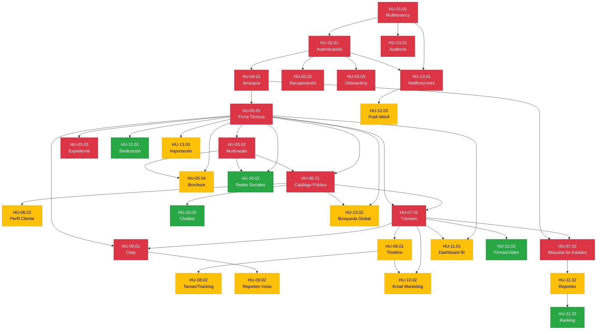

# Backlog — CRM Inmobiliario "Maru Bienes y Raíces"

> **Generado:** 21 de abril de 2026
> **Fuente:** [Requerimientos.md](file:///c:/proyectos/MaruBienesyRaices/CRM/web2/Requerimientos.md)
> **Metodología de priorización:** MoSCoW (Must / Should / Could / Won't)

---

## Resumen Ejecutivo

Se identificaron **30 historias de usuario** distribuidas en **16 épicas** a lo largo de **6 áreas funcionales**. El backlog está organizado de forma que las dependencias se respetan: primero la infraestructura base (Multitenancy, Seguridad, Auditoría, Jerarquía), luego los módulos de negocio core (Propiedades, Clientes, Embudo de Ventas) y finalmente los módulos avanzados (Marketing, BI, Integraciones).

---

## Tabla Consolidada del Backlog

| Código | Épica / Módulo | Historia (resumen) | Prioridad | Dependencias |
|:-------|:---------------|:-------------------|:----------|:-------------|
| **HU-01.01** | Multitenancy | Creación y configuración de empresas | 🔴 Must | — |
| **HU-02.01** | Seguridad — Autenticación | Login multicapa con 2FA, geocerca y bloqueo | 🔴 Must | HU-01.01 |
| **HU-02.02** | Seguridad — Recuperación | Recuperación de contraseña y desbloqueo de cuenta | 🔴 Must | HU-02.01 |
| **HU-02.03** | Seguridad — Onboarding | Activación de cuenta con contraseña y 2FA por primera vez | 🔴 Must | HU-02.01 |
| **HU-03.01** | Auditoría | Registro inmutable de todas las acciones en el sistema | 🔴 Must | HU-01.01 |
| **HU-04.01** | Jerarquía Organizacional | Gestión de roles, árbol jerárquico y visibilidad recursiva | 🔴 Must | HU-01.01, HU-02.01 |
| **HU-05.01** | Propiedades — Ficha Técnica | Registro de propiedades con tipología, precios y estados | 🔴 Must | HU-04.01 |
| **HU-05.02** | Propiedades — Multimedia | Carga de imágenes/videos y geolocalización con mapas | 🔴 Must | HU-05.01 |
| **HU-05.03** | Propiedades — Expediente | Propietarios, documentos legales y carta de comisión | 🔴 Must | HU-05.01 |
| **HU-05.04** | Propiedades — Marketing | Generación de brochure PDF y distribución multicanal | 🟡 Should | HU-05.01, HU-05.02 |
| **HU-06.01** | Portal del Cliente | Catálogo público filtrable con búsqueda avanzada | 🔴 Must | HU-05.01, HU-05.02 |
| **HU-06.02** | Portal del Cliente | Perfil, preferencias de búsqueda y alertas de inactividad | 🟡 Should | HU-06.01 |
| **HU-07.01** | Embudo de Ventas | Inicio de trámite y seguimiento por parte del cliente | 🔴 Must | HU-06.01, HU-05.01 |
| **HU-07.02** | Embudo de Ventas | Máquina de estados con concurrencia y reglas de bloqueo | 🔴 Must | HU-07.01, HU-04.01 |
| **HU-08.01** | Omnicanalidad | Línea de tiempo centralizada de interacciones | 🟡 Should | HU-07.01 |
| **HU-08.02** | Omnicanalidad | Tareas automáticas, tracking de email y productividad | 🟡 Should | HU-08.01 |
| **HU-09.01** | Agenda — Citas | Agendamiento de visitas con prevención de conflictos | 🔴 Must | HU-07.01, HU-05.01 |
| **HU-09.02** | Agenda — Reportes | Reprogramación por cliente y reporte obligatorio de visita | 🟡 Should | HU-09.01 |
| **HU-10.01** | Marketing — Redes Sociales | Publicación automática en Facebook/Instagram vía Meta API | 🟢 Could | HU-05.01, HU-05.02 |
| **HU-10.02** | Marketing — Email | Plantillas de respuesta rápida y correos automatizados | 🟡 Should | HU-07.01, HU-08.01 |
| **HU-10.03** | Marketing — Chatbot | Chatbot en portal web para captura de leads 24/7 | 🟢 Could | HU-06.01 |
| **HU-11.01** | BI — Métricas | Dashboard de interacción de propiedades | 🟡 Should | HU-05.01, HU-07.01 |
| **HU-11.02** | BI — Desempeño | Reportes estadísticos de cierres y comisiones | 🟡 Should | HU-07.02 |
| **HU-11.03** | BI — Ranking | Ranking anónimo de agentes con gamificación | 🟢 Could | HU-11.02 |
| **HU-12.01** | Ecosistema — Sindicación | Sincronización con portales externos (Zillow, ML, E24) | 🟢 Could | HU-05.01 |
| **HU-12.02** | Ecosistema — Firmas/Video | Integración con DocuSign y Zoom/Meet | 🟢 Could | HU-07.01 |
| **HU-12.03** | Ecosistema — Movilidad | Notificaciones push y app móvil | 🟡 Should | HU-13.01 |
| **HU-13.01** | Transversal — Notificaciones | Centro de notificaciones unificado | 🔴 Must | HU-01.01, HU-02.01 |
| **HU-13.02** | Transversal — Búsqueda | Barra de búsqueda global federada | 🟡 Should | HU-05.01, HU-06.01 |
| **HU-13.03** | Transversal — Importación | Importación masiva de datos desde Excel/CSV | 🟡 Should | HU-05.01 |

---

## Detalle de Historias de Usuario

---

### 🏢 Área 1: Infraestructura Base

---

#### HU-01.01 — Creación y Configuración de Empresas (Multitenancy)

| Campo | Detalle |
|:------|:--------|
| **Código** | HU-01.01 |
| **Épica** | Configuración y Administración Multiempresa |
| **Prioridad** | 🔴 Must |
| **Dependencias** | Ninguna (fundamento de todo el sistema) |
| **Sección origen** | §2 |

**Resumen:** Como Super Administrador, necesito crear y configurar empresas (tenants) con su nombre, logo, paleta de colores, plan comercial, moneda, zona horaria y límites de uso, garantizando que los datos de cada empresa estén completamente aislados mediante Row-Level Security en PostgreSQL. Cada empresa inicia con un administrador asignado y puede estar en estado Activa, Suspendida o Cancelada.

---

#### HU-02.01 — Autenticación Multicapa y Control de Acceso

| Campo | Detalle |
|:------|:--------|
| **Código** | HU-02.01 |
| **Épica** | Seguridad Perimetral y Autenticación |
| **Prioridad** | 🔴 Must |
| **Dependencias** | HU-01.01 |
| **Sección origen** | §3 — Épica 1 |

**Resumen:** Como usuario del sistema, necesito un login seguro con autenticación 2FA (Google Authenticator), geocerca por países/IPs, y un sistema de bloqueo progresivo por intentos fallidos (3→15min, 6→1h, 9→24h+admin). Incluye alertas por email ante accesos sospechosos, JWT con access_token de 15min y refresh_token de 7 días, política de contraseñas robusta (8+ caracteres, rotación cada 90 días), y límite de 2 sesiones concurrentes.

---

#### HU-02.02 — Recuperación de Cuenta

| Campo | Detalle |
|:------|:--------|
| **Código** | HU-02.02 |
| **Épica** | Seguridad Perimetral — Recuperación |
| **Prioridad** | 🔴 Must |
| **Dependencias** | HU-02.01 |
| **Sección origen** | §3 — Épica 2 |

**Resumen:** Como usuario, necesito poder recuperar mi acceso si olvidé mi contraseña (enlace de reset válido por 30 min, un solo uso) o si mi cuenta fue bloqueada (desbloqueo automático por tiempo o manual por Admin). El Admin puede resetear el 2FA de un usuario. Para restablecer contraseña se requiere verificación adicional (pregunta de seguridad o código SMS).

---

#### HU-02.03 — Onboarding de Nuevo Usuario

| Campo | Detalle |
|:------|:--------|
| **Código** | HU-02.03 |
| **Épica** | Seguridad Perimetral — Onboarding |
| **Prioridad** | 🔴 Must |
| **Dependencias** | HU-02.01 |
| **Sección origen** | §3 — Épica 3 |

**Resumen:** Como nuevo usuario creado por el Admin, recibo un enlace de activación (válido 48h) que me guía a crear mi contraseña y configurar 2FA por primera vez. Hasta completar este flujo, mi estado es "Pendiente" y no puedo acceder al sistema, garantizando que el Admin nunca conoce mi contraseña.

---

#### HU-03.01 — Registro Inmutable de Auditoría

| Campo | Detalle |
|:------|:--------|
| **Código** | HU-03.01 |
| **Épica** | Auditoría y Trazabilidad Inmutable |
| **Prioridad** | 🔴 Must |
| **Dependencias** | HU-01.01 |
| **Sección origen** | §4 |

**Resumen:** Como Administrador, necesito que toda acción CRUD genere un log inmutable con: fecha/hora (UTC + local), usuario, IP, user-agent, acción, módulo, entidad, tenant_id y payload del cambio (JSON diff antes/después). Ningún usuario puede modificar o eliminar logs. Incluye panel de consulta con filtros, exportación CSV, retención de 12 meses en BD principal y archivado automático a almacenamiento frío.

---

#### HU-04.01 — Estructura Organizacional y Visibilidad Recursiva

| Campo | Detalle |
|:------|:--------|
| **Código** | HU-04.01 |
| **Épica** | Gestión de Roles, Jerarquía y Visibilidad |
| **Prioridad** | 🔴 Must |
| **Dependencias** | HU-01.01, HU-02.01 |
| **Sección origen** | §5 |

**Resumen:** Como Administrador, necesito estructurar usuarios en un árbol jerárquico multinivel (Admin → Senior → Junior) con reglas de visibilidad recursiva: un Junior ve sus propiedades + las de su línea ascendente; un Senior ve y edita todo su downline. El sistema previene referencias circulares, permite reasignación masiva de subordinados, transferencia de propiedades/trámites al desactivar un usuario, y visualización del organigrama interactivo.

---

### 🏠 Área 2: Gestión de Propiedades

---

#### HU-05.01 — Ficha Técnica, Tipología, Precios y Ciclo de Vida

| Campo | Detalle |
|:------|:--------|
| **Código** | HU-05.01 |
| **Épica** | Propiedades — Registro y Ciclo de Vida |
| **Prioridad** | 🔴 Must |
| **Dependencias** | HU-04.01 |
| **Sección origen** | §6 |

**Resumen:** Como agente, necesito registrar propiedades con tipología (Casa, Depto, Local, Terreno, Oficina, Bodega), tipo de gestión (Venta/Renta/Ambas) con precios condicionales, ficha técnica completa (habitaciones, baños, superficie, amenidades, etc.) y una máquina de estados (Nuevo→Disponible→Reservado→Vendido/Rentado/Cancelado/Inactivo) con transiciones válidas definidas. Incluye sugerencia inteligente de precios basada en propiedades comparables en un radio de 5km usando PostGIS.

---

#### HU-05.02 — Multimedia y Geolocalización

| Campo | Detalle |
|:------|:--------|
| **Código** | HU-05.02 |
| **Épica** | Propiedades — Contenido Visual y Mapas |
| **Prioridad** | 🔴 Must |
| **Dependencias** | HU-05.01 |
| **Sección origen** | §7 |

**Resumen:** Como agente, necesito enriquecer la ficha con carga masiva de imágenes (máx. 30, 10MB c/u) y videos (máx. 3, 200MB c/u), generación automática de thumbnails y versiones optimizadas, selección de foto de portada, reordenamiento drag & drop, y marca de agua con logo de la empresa. Integración de mapas (Mapbox frontend / Google Maps geocoding backend) con pin de ubicación, Street View y puntos de interés cercanos.

---

#### HU-05.03 — Expediente Privado, Propietarios y Comisiones

| Campo | Detalle |
|:------|:--------|
| **Código** | HU-05.03 |
| **Épica** | Propiedades — Documentos Legales |
| **Prioridad** | 🔴 Must |
| **Dependencias** | HU-05.01 |
| **Sección origen** | §8 |

**Resumen:** Como agente, necesito vincular propietarios (CRUD independiente, búsqueda por nombre/DPI/teléfono) a propiedades, cargar documentación legal (Escrituras, planos, IUSI, contratos) con fechas de vencimiento y alertas automáticas 7 días antes, y generar Cartas de Comisión PDF con plantilla configurable por empresa y variables dinámicas. Se mantiene historial de versiones de documentos generados. Solo Admin y Senior pueden ver datos de propietarios.

---

#### HU-05.04 — Herramientas de Venta: Brochure y Distribución Digital

| Campo | Detalle |
|:------|:--------|
| **Código** | HU-05.04 |
| **Épica** | Propiedades — Marketing |
| **Prioridad** | 🟡 Should |
| **Dependencias** | HU-05.01, HU-05.02 |
| **Sección origen** | §9 |

**Resumen:** Como agente, necesito generar brochures PDF profesionales (con plantilla de la empresa, fotos, descripción, precio, mapa, datos de contacto) con tracking de apertura por identificador único, y distribuirlos por WhatsApp (click-to-chat con mensaje pre-configurado), email directo desde el CRM, o copiando un enlace público con tracking para compartir en cualquier canal.

---

### 👤 Área 3: Clientes y Embudo de Ventas

---

#### HU-06.01 — Catálogo Público y Descubrimiento de Propiedades

| Campo | Detalle |
|:------|:--------|
| **Código** | HU-06.01 |
| **Épica** | Portal del Cliente |
| **Prioridad** | 🔴 Must |
| **Dependencias** | HU-05.01, HU-05.02 |
| **Sección origen** | §10 — HU10.1 |

**Resumen:** Como cliente, necesito un portal público (con SSR para SEO) donde navegar propiedades en estado Disponible/Nuevo con filtros avanzados (tipo, precio, ubicación, habitaciones, superficie, gestión), ordenamiento (precio, fecha, relevancia), paginación de 12 propiedades, y vista dual de mapa/lista. El acceso al catálogo no requiere autenticación; funciones como guardar favoritos o iniciar trámites sí requieren cuenta.

---

#### HU-06.02 — Perfil del Cliente, Preferencias y Alertas de Inactividad

| Campo | Detalle |
|:------|:--------|
| **Código** | HU-06.02 |
| **Épica** | Portal del Cliente — Perfilamiento |
| **Prioridad** | 🟡 Should |
| **Dependencias** | HU-06.01 |
| **Sección origen** | §10 — HU10.2 |

**Resumen:** Como agente, necesito que los clientes registren su cuenta (con login social Google OAuth 2.0, sin 2FA), guarden sus preferencias de búsqueda (tipo, precio, zona), y que el sistema detecte automáticamente inactividad (configurable 7-30 días, default 21) para generar alertas al agente sugiriendo recontacto. El agente puede segmentar clientes por preferencias para campañas de reactivación.

---

#### HU-07.01 — Inicio y Seguimiento de Trámites

| Campo | Detalle |
|:------|:--------|
| **Código** | HU-07.01 |
| **Épica** | Embudo de Ventas |
| **Prioridad** | 🔴 Must |
| **Dependencias** | HU-06.01, HU-05.01 |
| **Sección origen** | §11 — HU11.1 |

**Resumen:** Como cliente, necesito iniciar un trámite de compra/renta sobre una propiedad y dar seguimiento a su avance desde mi perfil. El trámite se crea en estado "Interesado" y pueden existir múltiples interesados en la misma propiedad. El cliente ve la etapa exacta de su solicitud en su panel personal.

---

#### HU-07.02 — Máquina de Estados, Concurrencia y Reglas de Bloqueo

| Campo | Detalle |
|:------|:--------|
| **Código** | HU-07.02 |
| **Épica** | Embudo de Ventas — Core |
| **Prioridad** | 🔴 Must |
| **Dependencias** | HU-07.01, HU-04.01 |
| **Sección origen** | §11 — HU11.2 |

**Resumen:** Como administrador, necesito que los trámites (Interesado→Negociación→Cierre→Finalizado/Cancelado) se gestionen con reglas estrictas: al pasar a Negociación, la propiedad se reserva y se pausan otros trámites; solo un Senior puede presentar oferta competitiva (máximo 1 activa); timeout de 30 días en negociación; al finalizar se calcula comisión automáticamente; al cancelar se requiere motivo obligatorio de una lista predefinida y se reactivan trámites pausados.

---

### 📞 Área 4: Comunicaciones y Productividad

---

#### HU-08.01 — Línea de Tiempo de Interacciones

| Campo | Detalle |
|:------|:--------|
| **Código** | HU-08.01 |
| **Épica** | Omnicanalidad |
| **Prioridad** | 🟡 Should |
| **Dependencias** | HU-07.01 |
| **Sección origen** | §12 — HU12.1 |

**Resumen:** Como agente, necesito que cada trámite tenga una línea de tiempo cronológica que centralice todas las interacciones: emails, llamadas, mensajes WhatsApp, notas manuales, cambios de estado, citas y documentos adjuntos. Incluye nota rápida sin navegación y @menciones a otros agentes con notificación automática.

---

#### HU-08.02 — Tareas, Tracking de Email y Productividad

| Campo | Detalle |
|:------|:--------|
| **Código** | HU-08.02 |
| **Épica** | Omnicanalidad — Productividad |
| **Prioridad** | 🟡 Should |
| **Dependencias** | HU-08.01 |
| **Sección origen** | §12 — HU12.2 |

**Resumen:** Como agente, necesito tracking de apertura de emails (pixel de seguimiento con aviso de privacidad), creación de flujos automáticos de tareas recurrentes (ej. seguimiento cada 7 días), tipificación de tareas (Seguimiento, Llamada, Enviar documento, etc.) con prioridad y asignación jerárquica, y un panel consolidado tipo To-Do con filtros por prioridad, vencimiento y estado.

---

#### HU-09.01 — Agendamiento de Visitas con Prevención de Conflictos

| Campo | Detalle |
|:------|:--------|
| **Código** | HU-09.01 |
| **Épica** | Agenda Inteligente |
| **Prioridad** | 🔴 Must |
| **Dependencias** | HU-07.01, HU-05.01 |
| **Sección origen** | §13 — HU13.1 |

**Resumen:** Como agente, necesito agendar visitas a propiedades enviando invitaciones de calendario (.ics) que respeten mi disponibilidad real. El sistema oculta horarios ocupados, aplica un buffer configurable de 30min entre citas, y bloquea citas fuera del horario laboral definido por el agente. La cita se vincula al trámite, agente, cliente y propiedad.

---

#### HU-09.02 — Reprogramación por Cliente y Reporte de Visita

| Campo | Detalle |
|:------|:--------|
| **Código** | HU-09.02 |
| **Épica** | Agenda — Reportes de Campo |
| **Prioridad** | 🟡 Should |
| **Dependencias** | HU-09.01 |
| **Sección origen** | §13 — HU13.2 |

**Resumen:** Como agente, necesito que el cliente pueda reprogramar su visita desde un enlace seguro (token único) respetando bloques libres. 2 horas después de la cita, el CRM genera una tarea obligatoria de reporte con: nivel de interés (1-5), asistencia del cliente, comentarios positivos/negativos, opción de agendar nueva visita, fotos opcionales, y posibilidad de enviar resumen al propietario (sin datos del cliente).

---

### 📢 Área 5: Marketing e Inteligencia de Negocios

---

#### HU-10.01 — Publicación Automática en Redes Sociales

| Campo | Detalle |
|:------|:--------|
| **Código** | HU-10.01 |
| **Épica** | Marketing — Redes Sociales |
| **Prioridad** | 🟢 Could |
| **Dependencias** | HU-05.01, HU-05.02 |
| **Sección origen** | §14 — HU14.1 |

**Resumen:** Como agente, necesito conectar la cuenta de Meta de la agencia para publicar propiedades en Facebook/Instagram vía Graph API. Incluye publicación programada, historial de publicaciones con estado (Publicado/Error/Eliminado), y el envío automático de galería, precio y link a la página de la agencia.

---

#### HU-10.02 — Plantillas de Email y Correos Automatizados

| Campo | Detalle |
|:------|:--------|
| **Código** | HU-10.02 |
| **Épica** | Marketing — Email |
| **Prioridad** | 🟡 Should |
| **Dependencias** | HU-07.01, HU-08.01 |
| **Sección origen** | §14 — HU14.2 |

**Resumen:** Como agente, necesito un gestor de plantillas (CRUD) con variables dinámicas ({{nombre_cliente}}, {{titulo_propiedad}}, etc.), previsualización con datos de ejemplo, versionado de cambios, y triggers configurables que disparen correos automáticamente ante eventos: nuevo interesado, cambio de estado, nueva propiedad que matchea preferencias, cita agendada, o inactividad del lead.

---

#### HU-10.03 — Chatbot para Captura de Leads

| Campo | Detalle |
|:------|:--------|
| **Código** | HU-10.03 |
| **Épica** | Marketing — Chatbot |
| **Prioridad** | 🟢 Could |
| **Dependencias** | HU-06.01 |
| **Sección origen** | §14 — HU14.3 |

**Resumen:** Como administrador, necesito integrar un widget de chatbot en el portal web que capture datos básicos del visitante (nombre, teléfono, tipo de propiedad de interés) y lo inyecte como nuevo lead en el CRM. La asignación de agentes es configurable: Round Robin, Menos Carga, o Manual (bandeja de "Sin asignar").

---

#### HU-11.01 — Dashboard de Interacción de Propiedades

| Campo | Detalle |
|:------|:--------|
| **Código** | HU-11.01 |
| **Épica** | BI — Métricas de Inventario |
| **Prioridad** | 🟡 Should |
| **Dependencias** | HU-05.01, HU-07.01 |
| **Sección origen** | §15 — HU15.1 |

**Resumen:** Como agente, necesito un dashboard que clasifique mis propiedades por "Nivel de Interacción" usando un score ponderado (vistas:1pt, favoritos:2pts, emails abiertos:2pts, llamadas:3pts, citas:5pts, ofertas:10pts) recalculado cada 15 min en vista materializada. Incluye sugerencias automatizadas por inactividad (30d→reducir precio, 45d→revisar mercado, 60d→considerar pausa). Filtros por rango de fechas y exportación a PDF/Excel.

---

#### HU-11.02 — Reportes de Desempeño y Comisiones

| Campo | Detalle |
|:------|:--------|
| **Código** | HU-11.02 |
| **Épica** | BI — Desempeño |
| **Prioridad** | 🟡 Should |
| **Dependencias** | HU-07.02 |
| **Sección origen** | §15 — HU15.2 |

**Resumen:** Como agente, necesito generar reportes estadísticos de mis cierres, clientes contactados y comisiones proyectadas vs. realizadas para evaluar mi cumplimiento de metas. El administrador ve métricas globales: total de propiedades por estado (gráfico dona), embudo de conversión general, comisiones totales, y mapa de calor geográfico.

---

#### HU-11.03 — Ranking Anónimo de Agentes (Gamificación)

| Campo | Detalle |
|:------|:--------|
| **Código** | HU-11.03 |
| **Épica** | BI — Ranking |
| **Prioridad** | 🟢 Could |
| **Dependencias** | HU-11.02 |
| **Sección origen** | §15 — HU15.3 |

**Resumen:** Como agente, necesito ver mi posición en un ranking de ventas donde los demás aparecen como "Agente Oculto 1, 2, 3…" (RBAC). Solo el Administrador puede ver los nombres reales. Incentiva la competencia sana sin exposición directa de resultados individuales a compañeros.

---

### 🔌 Área 6: Integraciones, Movilidad y Módulos Transversales

---

#### HU-12.01 — Sindicación Inmobiliaria a Portales Externos

| Campo | Detalle |
|:------|:--------|
| **Código** | HU-12.01 |
| **Épica** | Ecosistema Extendido |
| **Prioridad** | 🟢 Could |
| **Dependencias** | HU-05.01 |
| **Sección origen** | §16 — HU16.1 |

**Resumen:** Como administrador, necesito conectar el inventario vía API/XML a portales externos (Zillow, MercadoLibre, Encuentra24). El admin elige qué propiedades van a qué portales con checkboxes. Estado de sincronización visible (Sincronizado/Pendiente/Error), frecuencia configurable por portal (tiempo real, cada hora, diario).

---

#### HU-12.02 — Firmas Digitales y Videollamadas

| Campo | Detalle |
|:------|:--------|
| **Código** | HU-12.02 |
| **Épica** | Ecosistema — Integraciones de Cierre |
| **Prioridad** | 🟢 Could |
| **Dependencias** | HU-07.01 |
| **Sección origen** | §16 — HU16.2 |

**Resumen:** Como agente, necesito enviar contratos vía DocuSign/Adobe Sign y agendar videollamadas con Zoom/Meet desde el CRM. El sistema escucha webhooks de DocuSign para avanzar el trámite automáticamente cuando el cliente firma. Los enlaces y documentos firmados se centralizan en el historial del trámite.

---

#### HU-12.03 — Notificaciones Push y App Móvil

| Campo | Detalle |
|:------|:--------|
| **Código** | HU-12.03 |
| **Épica** | Ecosistema — Movilidad |
| **Prioridad** | 🟡 Should |
| **Dependencias** | HU-13.01 |
| **Sección origen** | §16 — HU16.3 |

**Resumen:** Como agente en campo, necesito recibir notificaciones push en mi celular (FCM/APNs) sobre citas próximas, vencimientos de contratos, nuevos leads y recordatorios del sistema. Centro de notificaciones configurable donde cada tipo de alerta puede ser: Push, Email, Solo in-app, o Desactivada, para evitar fatiga de alertas.

---

#### HU-13.01 — Centro de Notificaciones Unificado

| Campo | Detalle |
|:------|:--------|
| **Código** | HU-13.01 |
| **Épica** | Módulos Transversales — Notificaciones |
| **Prioridad** | 🔴 Must |
| **Dependencias** | HU-01.01, HU-02.01 |
| **Sección origen** | §17.1 |

**Resumen:** Como usuario del CRM, necesito un icono de campana en el header con badge de no leídas, panel desplegable con las últimas 20 notificaciones (tipo, mensaje, fecha, link al recurso), acción de marcar como leída (individual o todas), y configuración de preferencias por tipo de alerta y canal de entrega.

---

#### HU-13.02 — Búsqueda Global Federada

| Campo | Detalle |
|:------|:--------|
| **Código** | HU-13.02 |
| **Épica** | Módulos Transversales — Búsqueda |
| **Prioridad** | 🟡 Should |
| **Dependencias** | HU-05.01, HU-06.01 |
| **Sección origen** | §17.2 |

**Resumen:** Como usuario del CRM, necesito una barra de búsqueda global (Ctrl+K o /) que busque simultáneamente en Propiedades, Clientes, Trámites y Agentes con resultados agrupados por entidad. Tipo-ahead tras 3 caracteres con debounce de 300ms, respetando siempre los permisos RBAC y la jerarquía del usuario.

---

#### HU-13.03 — Importación Masiva de Datos (Excel/CSV)

| Campo | Detalle |
|:------|:--------|
| **Código** | HU-13.03 |
| **Épica** | Módulos Transversales — Importación |
| **Prioridad** | 🟡 Should |
| **Dependencias** | HU-05.01 |
| **Sección origen** | §17.3 |

**Resumen:** Como administrador, necesito importar propiedades y contactos desde archivos Excel/CSV (máximo 500 registros) con plantilla descargable, validación previa que muestre registros válidos/erróneos/duplicados, opción de importación parcial (solo válidos), y registro de auditoría marcando el origen como "Importación masiva".

---

## Mapa de Dependencias

---

## Distribución por Prioridad

| Prioridad | Cantidad | Porcentaje | Historias |
|:----------|:---------|:-----------|:----------|
| 🔴 **Must** | 14 | 47% | HU-01.01, HU-02.01, HU-02.02, HU-02.03, HU-03.01, HU-04.01, HU-05.01, HU-05.02, HU-05.03, HU-06.01, HU-07.01, HU-07.02, HU-09.01, HU-13.01 |
| 🟡 **Should** | 11 | 37% | HU-05.04, HU-06.02, HU-08.01, HU-08.02, HU-09.02, HU-10.02, HU-11.01, HU-11.02, HU-12.03, HU-13.02, HU-13.03 |
| 🟢 **Could** | 5 | 16% | HU-10.01, HU-10.03, HU-11.03, HU-12.01, HU-12.02 |

---

> **Nota:** Este backlog fue generado a partir del documento de requerimientos consolidado v2.0. Las respuestas del checklist de validación (§23) ya están incorporadas (moneda multimoneda, umbral de inactividad 21 días, SSR requerido, R2 de Cloudflare, mapas híbridos Mapbox/Google, WhatsApp click-to-chat, PDF server-side).
